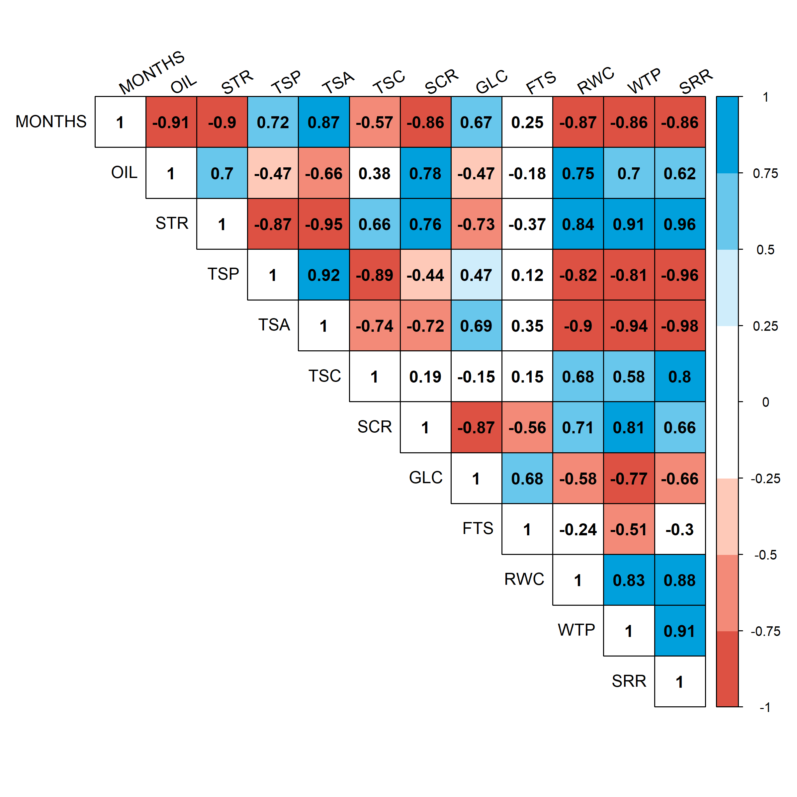

# Result and discusion

**Germination of aged seeds.** The germination of the seeds of *J. curcas* submitted to storage ranged from 9% to 15%, with values that are statistically similar to each other (Figure \@ref(fig:germination)A). Although twinning was not affected by storage, the mean germination time was significantly increased with time (Figure \@ref(fig:germination)B). The germination was completely asynchronous for all storage times, with a mean of 0.16 being recorded before storage and close to zero at other times (Figure \@ref(fig:germination)C). As it was observed, the germination in the time was significantly affected by the storage time, however, the germination uncertainty was not affected by the storage (Figure \@ref(fig:germination)D). It is verified that the seeds before storage and stored for 3 months began their germination on the 4th and the 3rd day after sowing respectively, while in other times the germination of the first seed was only computed from the 6th day the time for stabilization Of the germination was increased as the storage time was increased, being completed at 15 days without storage and at 23 days at 12 months of storage (Figure \@ref(fig:germination)E).

```{r 20130427PE}
url <- "https://docs.google.com/spreadsheets/d/1ecUgc1jjbxkd4WQsNEiyjl5Emx0O8KV5Cw4udX3pJI8/edit#gid=749789387"
fb <- gsheet2tbl(url)
```

```{r germination, fig.align='center', fig.cap= "Germinability (A), mean germination time (B), synchrony index (C), germination uncertainty (D) and temporal germination (E) evaluated in *Jatropha curcas* seeds in genotype 171 stored at 0, 3, 6, 9 And 12 months. The bars represent the mean (± SE). The mean differences between the storage months are represented by the lower case letters (SNK, p ≤ 0.05). N = 4"}

# data -------------------------------------------------------------

grm <- fb %>% dplyr::select(mes, rep, smt, g0:g25) %>% 
  dplyr::mutate(mes = factor(mes)) 

gix <- ger_summary(SeedN = "smt", evalName = "g", data = grm)

# germination ------------------------------------------------------

av <- aov(GRP ~ mes, gix)
#summary(av)
mc <- GerminaR::ger_testcomp(aov = av, comp = "mes")
grp <- fplot(data = mc, type = "bar", color = F,
             x = "mes", xlab = "Storage (months)", 
             y = "mean", ylab = "Germination '(%)'",
             z = "mes",
             lmt = c(0, 22),
             brk = 2,
             erb = T, 
             sig = "sg",
             lgd = "none")

#  mean germination time -------------------------------------------

av <- aov(MGT ~ mes, gix)
#summary(av)
mc <- GerminaR::ger_testcomp(aov = av, comp = "mes")
mgt <- fplot(data = mc, type = "bar", color = F,
             x = "mes", xlab = "Storage (months)", 
             y = "mean", ylab = "Mean germination time '(days)'",
             z = "mes",
             lmt = c(0, 22),
             brk = 2,
             erb = T, 
             sig = "sg",
             lgd = "none")

#  syncronia --------------------------------------------------------

av <- aov(SYN ~ mes, gix)
#summary(av)
mc <- GerminaR::ger_testcomp(aov = av, comp = "mes")
syn <- fplot(data = mc, type = "bar", color = F,
             x = "mes", xlab = "Storage (months)", 
             y = "mean", ylab = "Synchrony (bits)",
             z = "mes",
             lmt = c(0, 0.2),
             # brk = 2,
             erb = T, 
             sig = "sg",
             lgd = "none")


#  uncertany ----------------------------------------------------------

av <- aov(UNC ~ mes, gix)
#summary(av)
mc <- GerminaR::ger_testcomp(aov = av, comp = "mes")
unc <- fplot(data = mc, type = "bar", color = F,
             x = "mes", xlab = "Storage (months)", 
             y = "mean", ylab = "Uncertany",
             z = "mes",
             lmt = c(0, 2),
             #brk = 2,
             erb = T, 
             sig = "sg",
             lgd = "none")

#  Germination in time -------------------------------------------------

git <- ger_intime(Factor = "mes", SeedN = "smt", evalName = "g", data = grm) 


gt <- fplot(data = git, type = "line", color = F,
            x = "evaluation", 
            y = "mean", 
            z = "mes",
            ylab =  "Germination '(%)'",
            xlab = "days",
            erb = F, 
            lgl = "Storage (months)",
            lmt = c(0,22), 
            brk = 2, 
            lgd = c(0.18, 0.68))


gerv <- cowplot::plot_grid(ncol = 2, grp,   mgt, syn, unc, gt, labels = c("A", "B", "C", "D"))
cowplot::ggsave("img/gerv.png", dpi= 300, width = 210*0.9 , height = 297*0.7, units = "mm")
knitr::include_graphics("img/gerv.png")
```

**Biochemical responses of seeds submitted to aging.** It was verified that the oil content in the seeds remained practically stable until the sixth month of storage at the rate of 35%, with significant reductions from that date until the 12th month, when the oil content was approximately 29% (Figure \@ref(fig:bioquimico)A ), And the oil content in the seeds showed a reduction in time (r = -0.91, p ≤ 0.05, Figure \@ref(fig:corr)). On the other hand, the starch was rapidly metabolized with approximate reduction of 33% with time 12 months of storage (Figure \@ref(fig:bioquimico)B). Total soluble protein and total soluble amino acid content was increased by 160% and approximately 67% (Figure \@ref(fig:bioquimico)C-D) during storage. A high correlation (r = 0.92, p ≤ 0.05) is shown between total soluble proteins and amino acid syntheses.

There was a gradual reduction in the total soluble carbohydrate content at the third month of storage compared to the control, without showing differences until the 12th month of storage (Figure \@ref(fig:bioquimico2)A). Sucrose levels had a reduction of approximately 49% between 3 and 12 months of storage (Figure \@ref(fig:bioquimico2)B), but glucose levels remained stable until the 3rd month of storage. From the 6th month the glucose was rapidly elevated, reaching 71% in the 12th month in relation to the non-stored seeds (Figure \@ref(fig:bioquimico2)C). On the other hand, fructose levels did not show a trend during the months evaluated (Figure \@ref(fig:bioquimico2)D), while sucrose levels decreased (r = -0.57, p ≤ 0.05) throughout the storage period. Glucose (r = 0.67, p ≤ 0.05) had an opposite behavior, ie increase with storage (Figure \@ref(fig:corr))


```{r bioquimico, fig.align='center', fig.cap= "Oil content (A), amino acids B), total soluble protein (C), total soluble amino acids (D) evaluated in *Jatropha curcas* seeds in genotype 171 stored for 0, 3, 6, 9 and 12 months. The bars represent the mean (± SE). The mean differences between the storage months are represented by the lower case letters (SNK, p ≤ 0.05). N = 4."}

# datos -----------------------------------------------------

bqm <- fb %>% dplyr::select(mes, rep,  tra:scr) %>% 
  dplyr::mutate(mes = factor(mes)) 

# Oild content

av <- aov(oleo ~ mes, bqm)
#summary(av)
mc <- GerminaR::ger_testcomp(aov = av, comp = "mes")
oleo <- fplot(data = mc, type = "bar", color = F,
             x = "mes", xlab = "Storage (months)", 
             y = "mean", ylab = "Oil content ('%')",
             z = "mes",
             lmt = c(0, 40),
             #brk = 2,
             erb = T, 
             sig = "sg",
             lgd = "none")

# Aminoacidos

av <- aov(amd ~ mes, bqm)
#summary(av)
mc <- GerminaR::ger_testcomp(aov = av, comp = "mes")
amd <- fplot(data = mc, type = "bar", color = F,
             x = "mes", xlab = "Storage (months)", 
             y = "mean", ylab = "Starch (mmol Kg^{-1} MS)",
             z = "mes", 
             lmt = c(0, 270),
             brk = 30,
             erb = T, 
             sig = "sg",
             lgd = "none")

# Proteina solubles totales

av <- aov(pst ~ mes, bqm)
#summary(av)
mc <- GerminaR::ger_testcomp(aov = av, comp = "mes")
pst <- fplot(data = mc, type = "bar", color = F,
             x = "mes", xlab = "Storage (months)", 
             y = "mean", ylab = "Total soluble protein (g Kg^{-1} MS)",
             z = "mes", 
             lmt = c(0, 100),
             brk = 10,
             erb = T, 
             sig = "sg",
             lgd = "none")

# Aminoacido soluble total

av <- aov(ast ~ mes, bqm)
#summary(av)
mc <- GerminaR::ger_testcomp(aov = av, comp = "mes")
ast <- fplot(data = mc, type = "bar", color = F,
             x = "mes", xlab = "Storage (months)", 
             y = "mean", ylab = "Total soluble aminoacids (g Kg^{-1} MS)",
             z = "mes", 
             lmt = c(0, 27),
             brk = 3,
             erb = T, 
             sig = "sg",
             lgd = "none")


bioquim <- cowplot::plot_grid(ncol = 2, oleo, amd, pst, ast, labels = c("A", "B", "C", "D"))
cowplot::ggsave("img/bioquim.png", dpi= 300, width = 210*0.9 , height = 297*0.7, units = "mm")

knitr::include_graphics("img/bioquim.png")
```

```{r bioquimico2, fig.align='center', fig.cap= "Total soluble carbohydrates (A), sucrose B), glucose (C) and fructose (D) evaluated in *Jatropha curcas* seeds in genotype 171 were stored for 0, 3, 6, 9 and 12 months. The bars represent the mean (± SE). The mean differences between the storage months are represented by the lower case letters (SNK, p ≤ 0.05). N = 4."}

# Carbohidratos solubles totales

av <- aov(cst ~ mes, bqm)
#summary(av)
mc <- GerminaR::ger_testcomp(aov = av, comp = "mes")
cst <- fplot(data = mc, type = "bar", color = F,
             x = "mes", xlab = "Storage (months)", 
             y = "mean", ylab = "Total soluble carbohydrates (mmol Kg^{-1} MS)",
             z = "mes",
             lmt = c(0, 400),
             brk = 50,
             erb = T, 
             sig = "sg",
             lgd = "none")

av <- aov(scr ~ mes, bqm)
#summary(av)
mc <- GerminaR::ger_testcomp(aov = av, comp = "mes")
scr <- fplot(data = mc, type = "bar", color = F,
             x = "mes", xlab = "Storage (months)", 
             y = "mean", ylab = "Sucrose (mg Kg^{-1})",
             z = "mes",
             lmt = c(0, 7),
             brk = 1,
             erb = T, 
             sig = "sg",
             lgd = "none")

av <- aov(glc ~ mes, bqm)
#summary(av)
mc <- GerminaR::ger_testcomp(aov = av, comp = "mes")
glc <- fplot(data = mc, type = "bar", color = F,
             x = "mes", xlab = "Storage (months)", 
             y = "mean", ylab = "Glucose (mg Kg^{-1})",
             z = "mes",
             lmt = c(0, 10),
             brk = 1,
             erb = T, 
             sig = "sg",
             lgd = "none")

av <- aov(fts ~ mes, bqm)
#summary(av)
mc <- GerminaR::ger_testcomp(aov = av, comp = "mes")
fts <- fplot(data = mc, type = "bar", color = F,
             x = "mes", xlab = "Storage (months)", 
             y = "mean", ylab = "Fructose (mg Kg^{-1})",
             z = "mes",
             lmt = c(0, 5),
             brk = 0.5,
             erb = T, 
             sig = "sg",
             lgd = "none")

bioquim2 <- cowplot::plot_grid(ncol = 2, cst, scr, glc, fts, labels = c("A", "B", "C", "D"))
cowplot::ggsave("img/bioquim2.png", dpi= 300, width = 210*0.9 , height = 297*0.7, units = "mm")

knitr::include_graphics("img/bioquim2.png")
```

**Physiological responses of seeds submitted to aging.** With the storage time in desiccant agent, it was verified that the water content in the seeds was greatly reduced. Seeds prior to storage had water content of 8%, but reduced to 5.5% at 12 months of storage (Figure \@ref(fig:fisio)A). The water potential showed a reduction parallel to the water content, presenting a strong correlation (r = 0.83, p ≤ 0.05) between these two characteristics (Figure \@ref(fig:corr)). It is verified that the water potential of the seeds was decreased from -35 Mpa, without storage, to -124 MPa at 12 months of storage (Figure \@ref(fig:fisio)B). With the reduction of the relative water content and the water potential there was a drastic reduction in the respiratory rate of the seeds (r = 0.88, p ≤ 0.05), from 115 mmol CO~2~ h^-1^ g^-1^ MF to 10 mmol CO~2~ h^-1^ g^-1^ MF at time zero (Figure \@ref(fig:corr)), with a 91% reduction in respiratory rate in the seeds over the 12 months of storage (Figure \@ref(fig:fisio)C).

```{r fisio, fig.align='center', fig.cap= "Relative water content (A), water potential (B), respiratory rate (C), evaluated in *Jatropha curcas* seeds in genotype 171 stored at 0, 3, 6, 9 and 12 months. The bars represent the mean (± SE). The mean differences between the storage months are represented by the lower case letters (SNK, p ≤ 0.05). N = 4."}

# Contenido relativo de agua

av <- aov(tra ~ mes, bqm)
#summary(av)
mc <- GerminaR::ger_testcomp(aov = av, comp = "mes")
tra <- fplot(data = mc, type = "bar", color = F,
             x = "mes", xlab = "Storage (months)", 
             y = "mean", ylab = "Relative water content ('%')",
             z = "mes",
             lmt = c(0, 10),
             brk = 1,
             erb = T, 
             sig = "sg",
             lgd = "none")

# water potencial

av <- aov(yw*100 ~ mes, bqm)
#summary(av)
mc <- GerminaR::ger_testcomp(aov = av, comp = "mes")
yw <- fplot(data = mc, type = "bar", color = F,
             x = "mes", xlab = "Storage (months)", 
             y = "mean", ylab = "Water potential (Mpa)",
             z = "mes",
             lmt = c(-180, 0),
             brk = 20,
             erb = T,
            lgd = "none") + 
  geom_text(aes(label = sg , y = mean - ste), colour = "black", 
            size = 2, vjust = 1, angle = 0, position = position_dodge(0.9))

# transpiration

av <- aov(trs ~ mes, bqm)
#summary(av)
mc <- GerminaR::ger_testcomp(aov = av, comp = "mes")
trs <- fplot(data = mc, type = "bar", color = F,
             x = "mes", xlab = "Storage (months)", 
             y = "mean", ylab = "Respiratory rate (mmol CO[2] h^{-1} g^{-1})",
             z = "mes",
             lmt = c(0, 140),
             brk = 20,
             erb = T, 
             sig = "sg",
             lgd = "none")


fisio <- cowplot::plot_grid(ncol = 1, tra, yw, trs, labels = c("A", "B", "C", "D"))
cowplot::ggsave("img/fisio.png", dpi= 300, width = 210*0.425 , height = 297*0.9, units = "mm")
knitr::include_graphics("img/fisio.png")
```

```{r corr, fig.align='center', fig.cap= "Pearson correlation (P ≤ 0.05) of the variables evaluated in Jatropha curcas seeds in genotype 171 stored for 0, 3, 6, 9 and 12 months. TDO, oil content; AMD, starch; PST, total soluble protein; AST, total soluble amino acids; CST, total soluble carbohydrates; SCR, sucrose; GLC, glucose; FTS, fructose; TDA, water content in seeds; PTH, water potential; TRS, seed respiration rate."}

# Correlation -------------------------------------------------------------

dtc <- bqm %>% dplyr::mutate(mes = as.numeric(mes)) %>% 
              dplyr::select(
                             MES = mes,
                             TDO = oleo,
                             AMD = amd,
                             PST = pst,
                             AST = ast,
                             CST = cst,
                             SCR = scr,
                             GLC = glc,
                             FTS = fts,
                             TDA = tra, 
                             PTH = yw,
                             TRS = trs) 

cor <- agricolae::correlation(dtc, method = "pearson")

ppi <- 300
png("img/correlation.png", width=8*ppi, height=8*ppi, res=ppi)
col <- colorRampPalette(c("#DD5143", "#F38A78","#FEC9B8", "#FFFFFF", "#FFFFFF","#CFEDFB", "#68C7EC", "#00A0DC"))
crp <- corrplot::corrplot(corr = cor$correlation, method = "color", type = "upper", tl.col="black", tl.srt=30, addCoef.col = "black", col=col(8), p.mat = cor$pvalue, sig.level = 0.05, insig = "blank", addgrid.col = "black" )
graphics.off()


```

**Seed germination treated with NaCl.** Germination was almost naked at the concentration of 150 mM NaCl for all genotypes. For the control concentration (0 mM), seeds of accessions 183 and 114 had 71% and 86% of germination, respectively, with gradual decrease with the increase in NaCl concentration, from 0% to 150 mM and 4% to 100 mM . Genotypes 218 and 133 did not differ by up to 100 mM NaCl, although germination was reduced to approximately 5% at the concentration of 150 mM. Seeds of the accession 171 showed 65% germination in the control, reducing to 32% and 9% in 50 mM and 150 mM NaCl respectively (Figure 6A). The mean germination time for the control was 5 to 7 days in general for all accessions, while for the 150 mM NaCl concentration the interval was longer, ranging from 7.2 days to 12.3 days. No significant differences were observed in mean germination time from 50 mM to 75 mM, with a general average of 7.5 days for all genotypes (Figure 6B). There was no difference in the germination synchrony between the control accessions up to 75 mM NaCl; However, the synchronization at 100 mM was null at accesses 183, 114 and 218, as well as for access 133 in the concentration at 150 mM NaCl. It was observed that the synchrony values were always lower than 0.25 for all concentrations (Figure 6C), denoting a very asynchronous germinative profile. The maximum value for the uncertainty in germination in this experiment was 4.64 bits. Genotypes 183 and 114 showed a tendency to reduce uncertainty with the increase in NaCl concentration. The germination uncertainty was stable up to 75 mM NaCl, but with a significant increase in the concentration of 100 mM, where the uncertainty was 0.5 and 0.3 for the accessions 183 and 114, respectively. Accesses 218, 171 and 133 showed a trend in increasing uncertainty from 0 mM to 100 mM without showing significant differences. At 150mm, the uncertainty was 0.3, 0.7 and 0.5 for genotypes 218, 171 and 133 respectively (Figure 6D).

The cumulative germination presented differences for each of the genotypes. It was observed that, irrespective of access, germination in the treatments without stress began between the 3rd and 4th day after sowing; Whereas for the treatments with NaCl addition the maximum values of germination were observed between the 9th and 12th day (Figure 7A-E). Regardless of the evaluated genotype, germination was observed on the 3rd day in the control, while in the 50 mM and 75 mM treatments the germination was generally initiated on the 4th day, values that were elevated with 100 mM (5th day) and 150 mM NaCl (7th day). However, regardless of treatments and salinity levels, germination became stable from day 13 (Figure 7F).

```{r 20160902PE, eval=FALSE}
url <- "https://docs.google.com/spreadsheets/d/1dllWXzFE9ndO4ujbT2JPynvp9sDrDLpG5YCRO0KJn-c/edit#gid=439833954"
fb <- gsheet::gsheet2tbl(url) %>% as_data_frame()
```

```{r Germination, eval=F}

# germination data --------------------------------------------------------

dtg <- fb %>%  
  filter(SRP == 1) %>% 
  select(Genotype, Salt, SDN, D00:D25) %>% 
  mutate_all(funs(replace(., is.na(.), as.numeric(0)))) %>% 
  mutate_at(vars(starts_with("D")),funs(as.numeric)) %>% 
  mutate(Genotype = as.factor(Genotype))

dtg$Genotype <-   plyr::mapvalues(dtg$Genotype , from = c("G1", "G2", "G3", "G4", "G5"),
                                  to = c("183", "114", "218", "171", "133"))
smg <- ger_summary(SeedN = "SDN", evalName = "D", data = dtg)

# germination percentage --------------------------------------------------

av <- aov(GRP ~ Genotype*Salt, smg)
mc <- GerminaR::ger_testcomp(aov = av, comp = c("Genotype", "Salt")) %>% 
  arrange(Genotype) %>%
  mutate( s = c("Ba", "Bb", "Bb", "Dc", "Ac", 
                "Aa", "Aa", "Ab", "Dc", "Ac",
                "Da", "Ba", "Ca", "Ca", "Ab",
                "Ba", "Bc", "Ab", "Ab", "Ad",
                "Ca", "Ba", "Ba", "Ba", "Ab" ))

grp <-  GerminaR::fplot(mc, type = "bar",
                        x = "Genotype", xlab = "Genotypes",
                        y =  "mean", ylab = "Germination ('%')",
                        z = "Salt")


# mean germination time ---------------------------------------------------

av <- aov(MGT ~ Genotype*Salt, smg)
summary(av)
mc <- SNK.test(av, c("Genotype", "Salt"))
sm <- dtsm(mc)
sm <- sm %>% arrange(Genotype, factor(Salt, levels = c(0, 50, 75, 100))) %>%
  mutate( s = c("Aa", "Ab", "Ab", "Ac",  
                "Ba", "Ab", "Ab", "Ac", "Cc",
                "Ba", "Aa", "Ab", "Ac", "Bc",
                "Ba", "Ab", "Ab", "Ab", "Cc",
                "Aa", "Aa", "Aa", "Ab", "Ac" ))

# sm <- edit(sm)

mgtt <- sm %>% 
  select(Genotype, Salt, mean, ste, s) %>%  
  mutate(mean = round(mean,2), ste = round(ste,2)) %>% 
  unite(var, mean, ste, sep = " ? ") %>% 
  unite(MGT, var, s, sep = " ")

mgt <- GerminaR::fplot(sm, type = "bar",
             x = Genotype, y =  mean,  z = Salt,
             ylab = "tempo m?dio da germina??o (dias)" , xlab = "" ,
             lgl = "Sal (mM)" , lgd = "top",
             lmt = c(0, 15), brk = 0:20*1,
             sig = s, erb = T) + scale_fill_grey(expression("NaCl (mM)"), start = 1, end = 0) +
  scale_x_discrete(expression(" "), labels = c(183, 114, 218, 171, 133))


# sinchrony ---------------------------------------------------------------


av <- aov(SYN ~ Genotype*Salt, smg)
summary(av)
mc <- SNK.test(av, c("Genotype", "Salt"))
sm <- dtsm(mc)
sm <- sm %>% arrange(Genotype, factor(Salt, levels = c(0, 50, 75, 100))) %>%
  mutate( s = c("Aa", "Aa", "Aa", "Bb",  
                "Aa", "Aa", "Aa", "Bb", 
                "Aa", "Aa", "Bb", "Bb", "Ab",
                "Aa", "Aa", "Aa", "Aa", "Aa",
                "Aa", "Ab", "Aa", "Ab", "Ac" ))

synt <- sm %>% 
  select(Genotype, Salt, mean, ste, s) %>%  
  mutate(mean = round(mean,2), ste = round(ste,2)) %>% 
  unite(var, mean, ste, sep = " ? ") %>% 
  unite(SYN, var, s, sep = " ")

syn <- GerminaR::fplot(sm, type = "bar",
             x = Genotype, y =  mean,  z = Salt,
             ylab = "sincronia da germina??o" , xlab = "" ,
             lgl = "Sal (mM)" , lgd = "none",
             lmt = c(0, 0.351), brk = 0:35*0.05,
             sig = s, erb = T) + scale_fill_grey(expression("NaCl (mM)"),start = 1, end = 0) +
  scale_x_discrete(expression("gen?tipos"), labels = c(183, 114, 218, 171, 133)) 


# uncertany ---------------------------------------------------------------

av <- aov(UNC ~ Genotype*Salt, smg)
summary(av)
mc <- SNK.test(av, c("Genotype", "Salt"))
sm <- dtsm(mc)
sm <- sm %>%  arrange(Genotype, factor(Salt, levels = c(0, 50, 75, 100))) %>%
  mutate( s = c("Aa", "Aa", "Aa", "Bb", "Ac",
                "Aa", "Aa", "Aa", "Bb", "Ab",
                "Bb", "Aa", "Aa", "Aa", "Ac",
                "Aa", "Aa", "Aa", "Aa", "Ab",
                "Aa", "Aa", "Ab", "Aa", "Ab" ))

unct <- sm %>% 
  select(Genotype, Salt, mean, ste, s) %>%  
  mutate(mean = round(mean,2), ste = round(ste,2)) %>% 
  unite(var, mean, ste, sep = " ? ") %>% 
  unite(UNC, var, s, sep = " ")

unc <- GerminaR::fplot(sm, type = "bar",
             x = Genotype, y =  mean,  z = Salt,
             ylab = "incerteza da germina??o (bits)", xlab = "" ,
             lgl = "Sal (mM)" , lgd = "none",
             lmt = c(0, 3.5), brk = 0:20*.5,
             sig = s,erb = T) + scale_fill_grey(expression("NaCl (mM)"),start = 1, end = 0) +
  scale_x_discrete(expression("gen?tipos"), labels = c(183, 114, 218, 171, 133)) 


# germination multiplot ---------------------------------------------------

grmplot <- ggdraw() +
            draw_plot(grp, width = 0.5, height = 0.5, x = 0.0, y = 0.5) +
            draw_plot(mgt, width = 0.5, height = 0.5, x = 0.5, y = 0.5) +
            draw_plot(syn, width = 0.5, height = 0.5, x = 0.0, y = 0.0) +
            draw_plot(unc, width = 0.5, height = 0.5, x = 0.5, y = 0.0) +
            draw_plot_label(label = c("A", "B", "C", "D"), 
                          x = c(0.0, 0.5, 0.0, 0.5), 
                          y = c(1, 1, 0.5, 0.5))

#grmplot <- plot_grid(grp, mgt, syn, unc, ncol = 2, labels = "AUTO")

cowplot::ggsave("grmplot.tiff", dpi= 300, width = 210*0.9 , height = 297*0.5, units = "mm")

```

**Biometric and biomass components** Although the germination was evaluated up to the concentration of 150 mM NaCl, the biomass production was only computed up to 100 mM NaCl, and the biomass parameters were strongly affected by the increase in salinity. Regardless of the genotype, dry leaf biomass (PSF) accumulation was reduced to zero in 100 mM. For the control, the PSF did not show difference between the accessions 114, 171 and 183 with 5.19 g, 4.62 g and 5.11 g respectively. On the other hand, for genotypes 133 and 218 the PSF were 2.37 and 2.43, respectively. At the concentration of 50 mM, genotype 114 obtained the highest PSF at 1.39 g, followed by genotypes 171, 133, 183. Genotype 218 was the most sensitive to salinity, since it had PSF of 0.23 g. For the treatment of 75 mM, the PSF was reduced to values close to zero for all accessions (Table 2). For the dry weight of the root (PSR), genotype 114 presented the best development with 0, 50 and 75 mM NaCl in comparison to the other accessions, whereas for 100 mM the genotype 218 had greater accumulation of biomass in relation to the other accessions. Genotype 171 did not show differences in the accumulation of biomass for irrigation of 50, 75 and 100 mM with values of 0.31 g, 0.22 g and 0.26 g respectively. For stem dry weight (PSC), access 114 showed the best development at 0 mM and 50 mM, while accession 183 did not show significant differences between 50 mM and 75 mM NaCl treatments. At the concentration of 100 mM the genotypes 218, 133 and 171 showed an increase in the biomass accumulation of the stem with values of 0.98 g, 1.59 g and 2.40 g respectively. For the total dry weight (PST), genotype 114 was higher than the others, at least at concentrations of 0 and 50 mM, presenting values of 20.63 g and 4.31 g, respectively. Genotypes 171 and 183 did not show statistically significant differences in PST. Genotypes 133, 218 and 171 showed an increase in biomass at 100 mM, with values of 1.78 g, 1.85 g and 2.26 g, respectively, while the same genotypes at the 75 mM concentration showed no significant differences.

The parameters of unitary leaf area (AF) and total leaf area (AFT) were only possible to be evaluated until the concentration of 75 mM NaCl, since these were the parameters most affected by the increase of salts in the irrigation solution. The genotypes 218, 171 and133 presented the highest values in the control concentration, while for 50 mM the genotypes with the highest performance were 133, 114 and 183. The genotypes 133, 114, 171 and 183 for 75 mM presented values of 0, 4, 0.58, 0.73 and 1.97 cm 2, respectively. For the AFT variable, access 114 presented the highest value in the control treatment, followed by accessions 183 and 171 that did not show significant differences between them. At the concentration of 50 mM, genotype 114 continued to present larger leaf area, followed by access 133, while at the 75 mM concentration there was no difference between the accessions. There was a tendency of plant height reduction (CMP) with increasing salts (Table 2). The CMP reached approximately 13 cm in the control, but was strongly reduced until values smaller than 3 cm to 100 Mm of NaCl, fact clearly recorded in genotype 183 (Table 2). The diameter of the stem (DMC) presented reduction with the increase of the concentration of the salts, even without statistical differences. At concentrations of 50 mM and 75 mM, the accessions 183 and 114 obtained the highest values of stem diameter, while at the concentration of 100 mM they had the lowest values (Table 2).

For the leaf weight ratio (RPF), it is possible to observe a tendency in the reduction with the salinity increase, being genotype 218 presenting a ratio of 0.42, followed by genotype 183 with a ratio of 0.39. These two genotypes were the ones that best behaved in this allometric parameter. Genotype 171 showed no significant difference in RPF up to 50 mM, while genotype 114 increased its biomass accumulation to 50 mM. All genotypes showed drastic reduction from 75 mM NaCl, with a reduction of biomass accumulation in the leaf with increasing NaCl concentration in the irrigation water (Figure 8A). A distinct profile is verified in the stem dry weight ratio (RPC), which was increased with elevation of salinity, even though no significant effect was observed up to the 50 mM concentration. For the 75 mM concentration, genotype 183 was better than the others, although similar to genotypes 171 and 133 at 100 mM concentration (Figure 8B). The root weight ratio (RPR) showed a distinct behavior for each genotype, with genotypes 171, 133 and 218, increasing biomass of the roots up to 75 mM, and the latter showed a continuous increment up to 100 mM. On the other hand, the genotype 183 showed increment up to 50 mM and from there had its values reduced. Genotype 114 was apparently unaffected by the increase in NaCl concentration (Figure 8C). In the aerial weight characteristic (APR), it was not possible to observe a trend with increasing NaCl concentration; However, genotypes 183, 114, 171 and 133 in the treatment of 100 mM obtained the highest values of RPA in this respect of the other salt treatments, while genotype 218 showed reduced RPA when salinity increased (Figure 8D).


```{r morphological, eval=F}

dtmv <- fb %>% 
  dplyr::select(Genotype, Salt, LDW = LDB, SDW = SDB, RDW = RDB, TLFA, LFA, HGT.24, STD.24) %>% 
  dplyr::mutate(Salt = factor(Salt, levels = c(0, 50, 75, 100, 150)), 
                TDW = LDW+SDW+RDW, STDW = SDW+LDW) %>% 
  dplyr::mutate(LWR = LDW/TDW,
                SWR = SDW/TDW,
                STWR = STDW/TDW,
                RWR = RDW/TDW,
                LAR = TLFA/TDW,
                RSR = RDW/STDW) %>% 
  dplyr::select(Genotype, Salt, LDW, SDW, RDW, STDW, TDW, TLFA, LFA, LWR, SWR, RWR, STWR, RSR, LAR, HGT.24, STD.24)

dtmv <- as.data.frame(dtmv)
str(dtmv)

```


**Multivariate analysis of the salinity experiment** The germination parameters were negatively affected by the increase in the salt concentration; There was a negative correlation between germination percentage (r = -0.55, p ≤ 0.05) and germination synchrony (r = -0.69, p value ≤ 0.001). On the other hand, the mean germination time was positively significant when correlated with the increase of salts
(R = 0.66, p ≤ 0.001). However, there was no significant correlation between germination uncertainty and salt increase (r = -0.23, p = 0.321). The biomass parameters were significantly affected with increasing salts. The correlations between this parameter in relation to the leaf dry weight (r = -0.86, p ≤ 0.001), the leaf area (r = -0.89, p ≤ 0.001), and plant height ( R = -0.89, p ≤ 0.001) and stem diameter (r = -0.91, p ≤ 0.001). Other allometric parameters were also influenced by saline addition; (R = -0.90, p ≤ 0.001) and leaf area ratio (r = -0.94, p ≤ 0.001) were used to estimate the negative relationship between salinity and leaf weight ratio. Other allometric characteristics, on the other hand, were strongly increased with salinity; The increase in the ratio of stem weight
(R = 0.74, p ≤0.001). The analysis of the main components shows that approximately 74% of the variation can be explained by the parameters studied in this work. In the first component the variables PSF, AFT, CMP and PST were the ones that presented the greatest contribution in the variance and are negatively correlated with the increase of NaCl, while the variables with positive correlation were the TMG and RPC. The genotypes that showed the best response were 114, 171 and 183 and the susceptible genotypes 133 and 218 (Figure 9).
