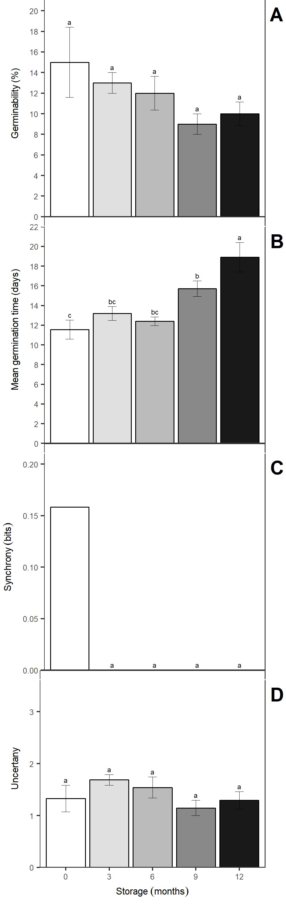
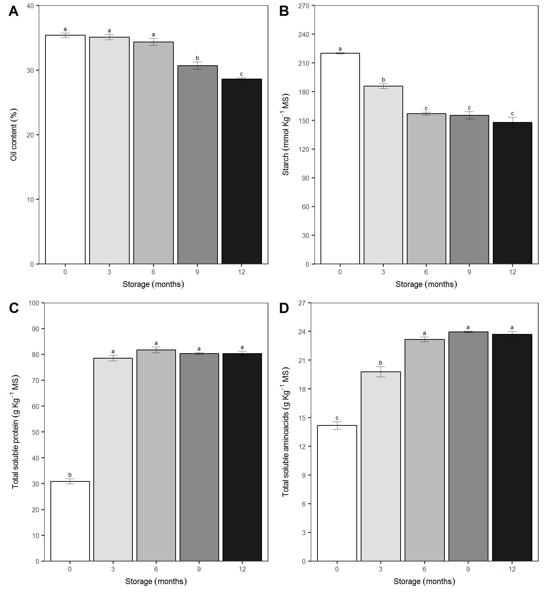
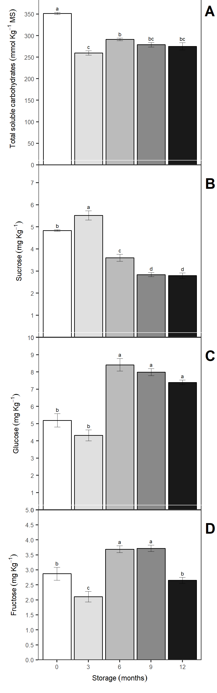
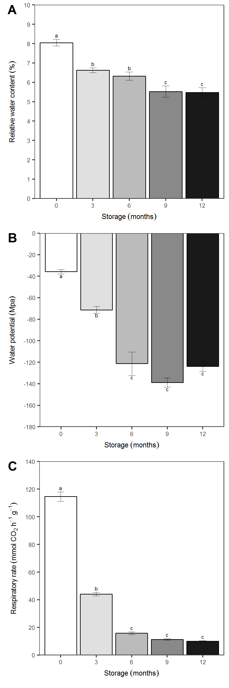
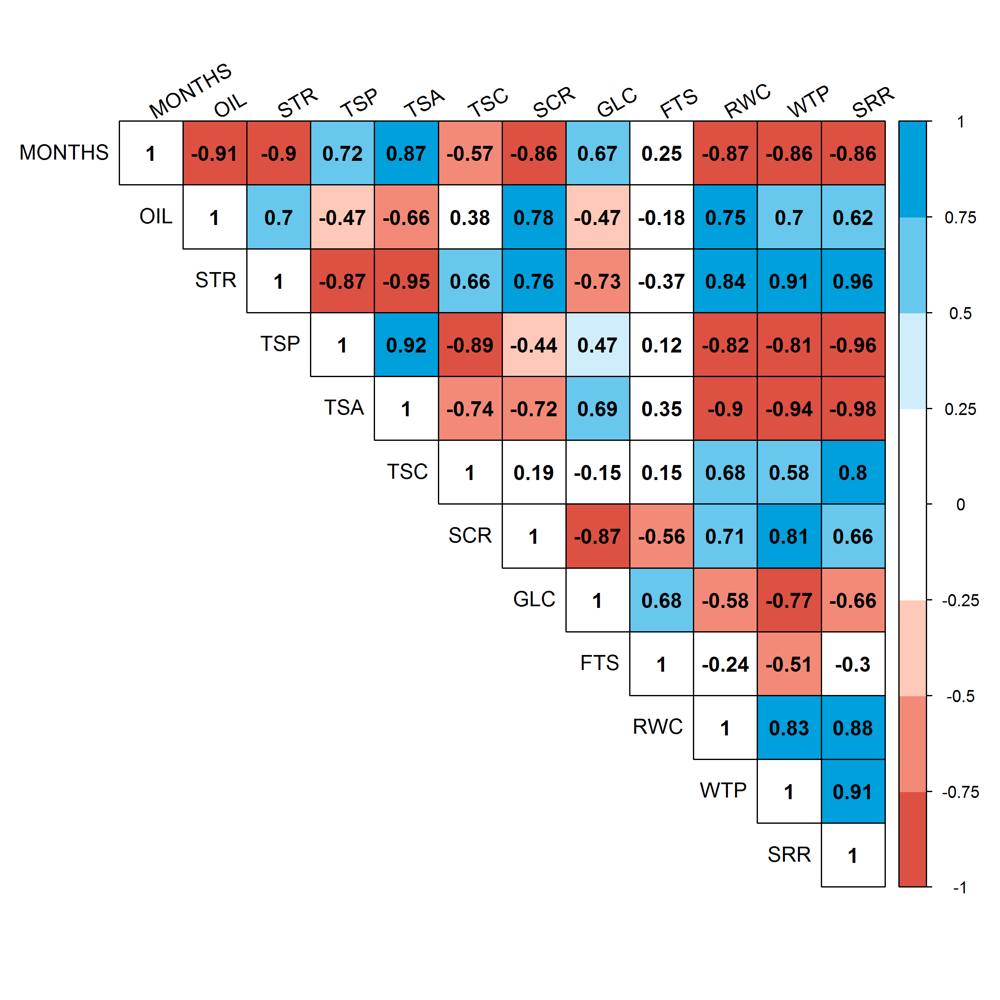
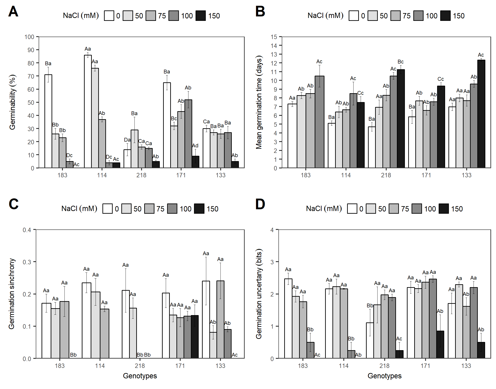
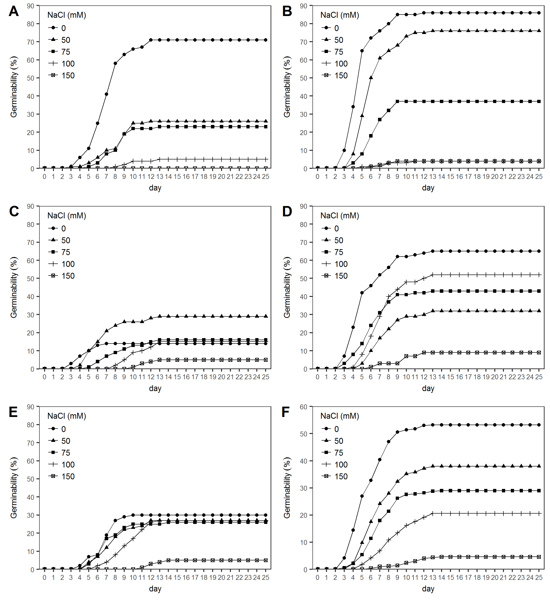
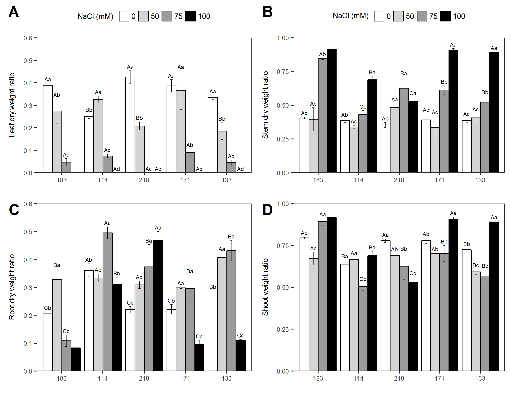
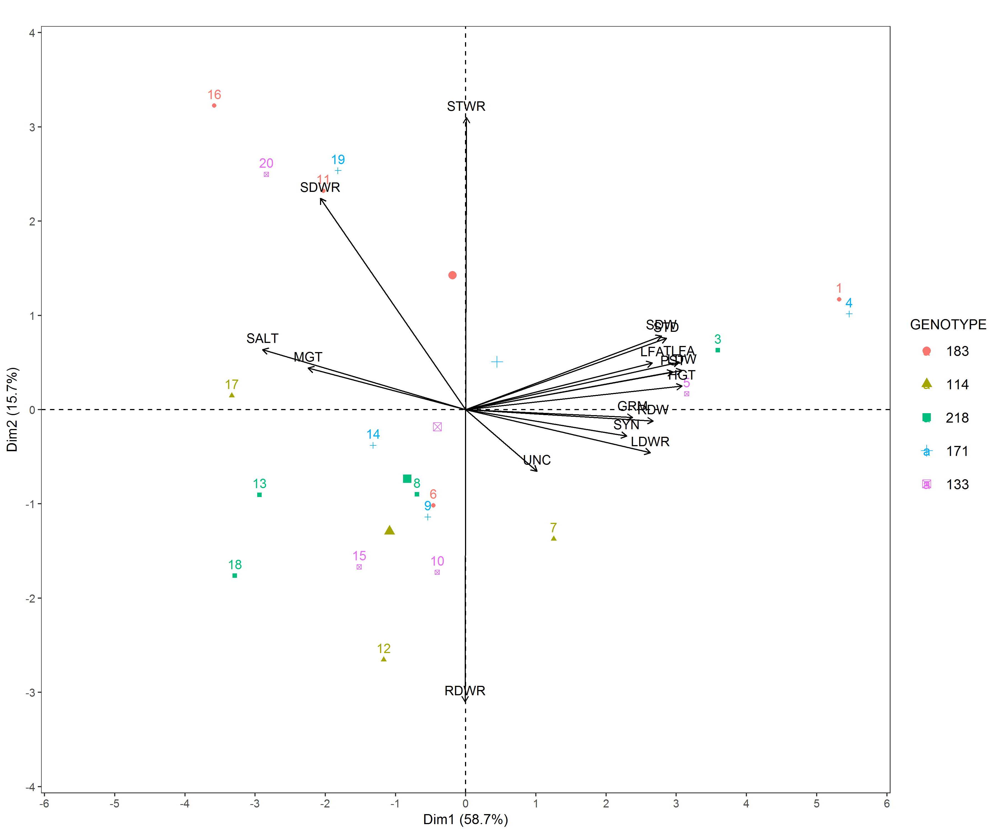

# Results

**Germination of aged seeds.** The germination of the *J. curcas* seeds submitted to storage ranged from 9% to 15%, with values that are statistically similar to each other (Figure \@ref(fig:germination)A). Although germination was not affected by storage, the mean germination time was significantly increased with storage time (Figure \@ref(fig:germination)B). The germination was completely asynchronous for all storage times, with a mean of 0.16 being recorded before storage and close to zero at other times (Figure \@ref(fig:germination)C). As it was observed, the germination in the time was significantly affected by the storage time (Figure 1E). however, the germination uncertainty was not affected by the storage (Figure \@ref(fig:germination)D). It is verified that the seeds before storage and stored for 3 months began their germination on the 3^rd^ and the 4^th^ day after sowing respectively, while in other times the germination of the first seed was only computed from the 6^th^ day the time for stabilization of the germination was increased as the storage time was increased, being completed at 15 days without storage and at 23 days at 12 months of storage (Figure \@ref(fig:germination)E).


```{r 20130427PE}
url <- "https://docs.google.com/spreadsheets/d/1ecUgc1jjbxkd4WQsNEiyjl5Emx0O8KV5Cw4udX3pJI8/edit#gid=749789387"
fb <- gsheet::gsheet2tbl(url)
```

```{r germination, fig.align='center', fig.cap= "Germinability (A), mean germination time (B), synchrony index (C), germination uncertainty (D) and temporal germination (E) evaluated in *Jatropha curcas* seeds in genotype 171 stored at 0, 3, 6, 9 and 12 months. The bars represent the mean (± SE). The mean differences between the storage months are represented by the lower case letters (SNK, p = 0.05). n = 4"}

# data -------------------------------------------------------------

grm <- fb %>% dplyr::select(mes, rep, smt, g0:g25) %>% 
  dplyr::mutate(mes = factor(mes)) 

gix <- ger_summary(SeedN = "smt", evalName = "g", data = grm)

# germination ------------------------------------------------------

av <- aov(GRP ~ mes, gix)
#summary(av)
mc <- GerminaR::ger_testcomp(aov = av, comp = "mes")
grp <- fplot(data = mc, type = "bar", color = F,
             x = "mes", xlab = "Storage (months)", 
             y = "mean", ylab = "Germinability '(%)'",
             z = "mes",
             lmt = c(0, 22),
             brk = 2,
             erb = T, 
             sig = "sg",
             lgd = "none")

#  mean germination time -------------------------------------------

av <- aov(MGT ~ mes, gix)
#summary(av)
mc <- GerminaR::ger_testcomp(aov = av, comp = "mes")
mgt <- fplot(data = mc, type = "bar", color = F,
             x = "mes", xlab = "Storage (months)", 
             y = "mean", ylab = "Mean germination time '(days)'",
             z = "mes",
             lmt = c(0, 22),
             brk = 2,
             erb = T, 
             sig = "sg",
             lgd = "none")

#  syncronia --------------------------------------------------------

av <- aov(SYN ~ mes, gix)
#summary(av)
mc <- GerminaR::ger_testcomp(aov = av, comp = "mes")
syn <- fplot(data = mc, type = "bar", color = F,
             x = "mes", xlab = "Storage (months)", 
             y = "mean", ylab = "Synchrony (bits)",
             z = "mes",
             lmt = c(0, 0.2),
             # brk = 2,
             erb = T, 
             sig = "sg",
             lgd = "none")


#  uncertany ----------------------------------------------------------

av <- aov(UNC ~ mes, gix)
#summary(av)
mc <- GerminaR::ger_testcomp(aov = av, comp = "mes")
unc <- fplot(data = mc, type = "bar", color = F,
             x = "mes", xlab = "Storage (months)", 
             y = "mean", ylab = "Uncertany",
             z = "mes",
             lmt = c(0, 2),
             #brk = 2,
             erb = T, 
             sig = "sg",
             lgd = "none")

#  Germination in time -------------------------------------------------

git <- ger_intime(Factor = "mes", SeedN = "smt", evalName = "g", data = grm) 


gt <- fplot(data = git, type = "line", color = F,
            x = "evaluation", 
            y = "mean", 
            z = "mes",
            ylab =  "Germinability '(%)'",
            xlab = "days",
            erb = F, 
            lgl = "Storage (months)",
            lmt = c(0,22), 
            brk = 2, 
            lgd = c(0.18, 0.68))


gerv <- cowplot::plot_grid(ncol = 2, grp,   mgt, syn, unc, gt, labels = c("A", "B", "C", "D"))
cowplot::ggsave("img/gerv.png", dpi= 300, width = 210*0.9 , height = 297*0.7, units = "mm")

```

**Biochemical responses of seeds submitted to aging.** It was verified that the oil content in the seeds remained practically stable until the sixth month of storage at the rate of 35%, with significant reductions from 12th month of storage, when the oil content was approximately 29% (Figure \@ref(fig:bioquimico)A). We verified a strong and negative correlation between oil content in the seeds and storage time (r = -0.91, p ≤ 0.05). On the other hand, the starch was rapidly metabolized with approximate reduction of 33% with time 12 months of storage (Figure \@ref(fig:bioquimico)B). Total soluble protein and total soluble amino acid content was increased by 160% and approximately 67% during storage (Figure \@ref(fig:bioquimico)C-D). A strong and positive correlation (r = 0.92, p ≤ 0.05) is shown between total soluble proteins and amino acid syntheses.

There was a gradual reduction in the total soluble carbohydrate content at the 3^rd^ month of storage compared to the control, without showing differences until the 12^th^ month of storage (Figure \@ref(fig:bioquimico2)A). Sucrose levels had a reduction of approximately 49% between 3 and 12 months of storage (Figure \@ref(fig:bioquimico)B), while glucose levels remained stable until the 3rd month of storage when compared to non-stored seeds. From the 6^th^ month, the glucose was rapidly elevated, reaching 71% in the 12^th^ month in relation to the non-stored seeds  (Figure \@ref(fig:bioquimico2)C). On the other hand, fructose levels did not show a trend during the months evaluated  (Figure \@ref(fig:bioquimico2)D). We showed that while sucrose levels decreased (r = -0.57, p ≤ 0.05) throughout the storage period, glucose (r = 0.67, p ≤ 0.05) had an opposite behavior, with increase with storage.

```{r bioquimico, fig.align='center', fig.cap= "Oil content (A), starch (B), total soluble protein (C), total soluble amino acids (D) evaluated in *Jatropha curcas* seeds in genotype 171 stored for 0, 3, 6, 9 and 12 months. The bars represent the mean (± SE). The mean differences between the storage months are represented by the lower case letters (SNK, p = 0.05). n = 4"}

# datos -----------------------------------------------------

bqm <- fb %>% dplyr::select(mes, rep,  tra:scr) %>% 
  dplyr::mutate(mes = factor(mes)) 

# Oild content

av <- aov(oleo ~ mes, bqm)
#summary(av)
mc <- GerminaR::ger_testcomp(aov = av, comp = "mes")
oleo <- fplot(data = mc, type = "bar", color = F,
             x = "mes", xlab = "Storage (months)", 
             y = "mean", ylab = "Oil content ('%')",
             z = "mes",
             lmt = c(0, 40),
             #brk = 2,
             erb = T, 
             sig = "sg",
             lgd = "none") +
  
  theme(axis.title.x=element_blank(),
        axis.text.x=element_blank(),
        axis.ticks.x=element_blank())

# Aminoacidos

av <- aov(amd ~ mes, bqm)
#summary(av)
mc <- GerminaR::ger_testcomp(aov = av, comp = "mes")
amd <- fplot(data = mc, type = "bar", color = F,
             x = "mes", xlab = "Storage (months)", 
             y = "mean", ylab = "Starch (mmol Kg^{-1} MS)",
             z = "mes", 
             lmt = c(0, 270),
             brk = 30,
             erb = T, 
             sig = "sg",
             lgd = "none") +
  
  theme(axis.title.x=element_blank(),
        axis.text.x=element_blank(),
        axis.ticks.x=element_blank())

# Proteina solubles totales

av <- aov(pst ~ mes, bqm)
#summary(av)
mc <- GerminaR::ger_testcomp(aov = av, comp = "mes")
pst <- fplot(data = mc, type = "bar", color = F,
             x = "mes", xlab = "Storage (months)", 
             y = "mean", ylab = "Total soluble protein (g Kg^{-1} MS)",
             z = "mes", 
             lmt = c(0, 100),
             brk = 10,
             erb = T, 
             sig = "sg",
             lgd = "none") +
  
  theme(axis.title.x=element_blank(),
        axis.text.x=element_blank(),
        axis.ticks.x=element_blank())

# Aminoacido soluble total

av <- aov(ast ~ mes, bqm)
#summary(av)
mc <- GerminaR::ger_testcomp(aov = av, comp = "mes")
ast <- fplot(data = mc, type = "bar", color = F,
             x = "mes", xlab = "Storage (months)", 
             y = "mean", ylab = "Total soluble aminoacids (g Kg^{-1} MS)",
             z = "mes", 
             lmt = c(0, 27),
             brk = 3,
             erb = T, 
             sig = "sg",
             lgd = "none")


bioquim <- cowplot::plot_grid(ncol = 1, oleo, amd, pst, ast, labels = c("A", "B", "C", "D"))
cowplot::ggsave("img/bioquim.png", dpi= 300, width = 210*0.4 , height = 297*0.9, units = "mm")


```

```{r bioquimico2, fig.align='center', fig.cap= "Total soluble carbohydrates (A), sucrose (B), glucose (C) and fructose (D) evaluated in *Jatropha curcas* seeds in genotype 171 were stored for 0, 3, 6, 9 and 12 months. The bars represent the mean (± SE). The mean differences between the storage months are represented by the lower case letters (SNK, p = 0.05). n = 4"}

# Carbohidratos solubles totales

av <- aov(cst ~ mes, bqm)
#summary(av)
mc <- GerminaR::ger_testcomp(aov = av, comp = "mes")
cst <- fplot(data = mc, type = "bar", color = F,
             x = "mes", xlab = "Storage (months)", 
             y = "mean", ylab = "Total soluble carbohydrates (mmol Kg^{-1} MS)",
             z = "mes",
             lmt = c(0, 400),
             brk = 50,
             erb = T, 
             sig = "sg",
             lgd = "none") +
  
  theme(axis.title.x=element_blank(),
        axis.text.x=element_blank(),
        axis.ticks.x=element_blank())

av <- aov(scr ~ mes, bqm)
#summary(av)
mc <- GerminaR::ger_testcomp(aov = av, comp = "mes")
scr <- fplot(data = mc, type = "bar", color = F,
             x = "mes", xlab = "Storage (months)", 
             y = "mean", ylab = "Sucrose (mg Kg^{-1})",
             z = "mes",
             lmt = c(0, 7),
             brk = 1,
             erb = T, 
             sig = "sg",
             lgd = "none") +
  
  theme(axis.title.x=element_blank(),
        axis.text.x=element_blank(),
        axis.ticks.x=element_blank())

av <- aov(glc ~ mes, bqm)
#summary(av)
mc <- GerminaR::ger_testcomp(aov = av, comp = "mes")
glc <- fplot(data = mc, type = "bar", color = F,
             x = "mes", xlab = "Storage (months)", 
             y = "mean", ylab = "Glucose (mg Kg^{-1})",
             z = "mes",
             lmt = c(0, 10),
             brk = 1,
             erb = T, 
             sig = "sg",
             lgd = "none") +
  
  theme(axis.title.x=element_blank(),
        axis.text.x=element_blank(),
        axis.ticks.x=element_blank())

av <- aov(fts ~ mes, bqm)
#summary(av)
mc <- GerminaR::ger_testcomp(aov = av, comp = "mes")
fts <- fplot(data = mc, type = "bar", color = F,
             x = "mes", xlab = "Storage (months)", 
             y = "mean", ylab = "Fructose (mg Kg^{-1})",
             z = "mes",
             lmt = c(0, 5),
             brk = 0.5,
             erb = T, 
             sig = "sg",
             lgd = "none")

bioquim2 <- cowplot::plot_grid(ncol = 1, cst, scr, glc, fts, labels = c("A", "B", "C", "D"))
cowplot::ggsave("img/bioquim2.png", dpi= 300, width = 210*0.4 , height = 297*0.9, units = "mm")


```

**Physiological responses of seeds submitted to aging.** With the storage time in desiccant agent, it was verified that the water content in the seeds was greatly reduced (Figure \@ref(fig:fisio)). Non-stored seeds had 8% of water content, while seeds stored by 12 months had 5.5% (Figure \@ref(fig:fisio)A). Concomitantly the water content, the seeds water potential had a strong reduction with the storage time, presenting a strong correlation (r = 0.83, p ≤ 0.05) between these two characteristics. We verified that the water potential of non-stred seeds were -35 MPa, but water potential were reduced to -124 MPa at 12 months of storage (Figure \@ref(fig:fisio)B). With the reduction of the relative water content and the water potential there was a strong reduction in the respiratory rate of the seeds (r = 0.88, p ≤ 0.05), ranging 115 mmol CO~2~ h^-1^ g^-1^ MF, in non-stored seeds to 10 mmol CO~2~ h^-1^ g^-1^ MF after 12 months of storage (Figure \@ref(fig:fisio)), a reduction of 91% over the seeds storage (Figure \@ref(fig:fisio)C).

```{r fisio, fig.align='center', fig.cap= "Relative water content (A), water potential (B), seed respiratory rate (C), evaluated in *Jatropha curcas* seeds in genotype 171 stored at 0, 3, 6, 9 and 12 months. The bars represent the mean (± SE). The mean differences between the storage months are represented by the lower case letters (SNK, p = 0.05). n = 4. "}

# Contenido relativo de agua

av <- aov(tra ~ mes, bqm)
#summary(av)
mc <- GerminaR::ger_testcomp(aov = av, comp = "mes")
tra <- fplot(data = mc, type = "bar", color = F,
             x = "mes", xlab = "Storage (months)", 
             y = "mean", ylab = "Relative water content ('%')",
             z = "mes",
             lmt = c(0, 10),
             brk = 1,
             erb = T, 
             sig = "sg",
             lgd = "none") +
  
  theme(axis.title.x=element_blank(),
        axis.text.x=element_blank(),
        axis.ticks.x=element_blank())

# water potencial

av <- aov(yw*100 ~ mes, bqm)
#summary(av)
mc <- GerminaR::ger_testcomp(aov = av, comp = "mes")
yw <- fplot(data = mc, type = "bar", color = F,
             x = "mes", xlab = "Storage (months)", 
             y = "mean", ylab = "Water potential (Mpa)",
             z = "mes",
             lmt = c(-180, 0),
             brk = 20,
             erb = T,
            lgd = "none") + 
  geom_text(aes(label = sg , y = mean - ste), colour = "black", 
            size = 2, vjust = 1, angle = 0, position = position_dodge(0.9)) +
  
  theme(axis.title.x=element_blank(),
        axis.text.x=element_blank(),
        axis.ticks.x=element_blank())

# transpiration

av <- aov(trs ~ mes, bqm)
#summary(av)
mc <- GerminaR::ger_testcomp(aov = av, comp = "mes")
trs <- fplot(data = mc, type = "bar", color = F,
             x = "mes", xlab = "Storage (months)", 
             y = "mean", ylab = "Respiratory rate (mmol CO[2] h^{-1} g^{-1})",
             z = "mes",
             lmt = c(0, 140),
             brk = 20,
             erb = T, 
             sig = "sg",
             lgd = "none")


fisio <- cowplot::plot_grid(ncol = 1, tra, yw, trs, labels = c("A", "B", "C", "D"))
cowplot::ggsave("img/fisio.png", dpi= 300, width = 210*0.425 , height = 297*0.9, units = "mm")

```

```{r corr, eval=FALSE, fig.align='center', fig.cap= "Pearson correlation (p = 0.05) of the variables evaluated in *Jatropha curcas* seeds in genotype 171 stored for 0, 3, 6, 9 and 12 months. OIL, oil content; STR, starch; TSP, total soluble protein; TSA, total soluble amino acids; TSC, total soluble carbohydrates; SCR, sucrose; GLC, glucose; FTS, fructose; RWC, relative water content in seeds; WTP, water potential; SRR, seed respiration rate. "}

# Correlation -------------------------------------------------------------

dtc <- bqm %>% dplyr::mutate(mes = as.numeric(mes)) %>% 
              dplyr::select(
                            MONTHS = mes,
                            OIL = oleo, 
                            STR = amd,
                            TSP = pst,
                            TSA = ast,
                            TSC = cst,
                            SCR = scr,
                            GLC = glc,
                            FTS = fts,
                            RWC = tra,
                            WTP = yw,
                            SRR = trs) 

cor <- agricolae::correlation(dtc, method = "pearson")

ppi <- 300
png("img/correlation.png", width=8*ppi, height=8*ppi, res=ppi)
col <- colorRampPalette(c("#DD5143", "#F38A78","#FEC9B8", "#FFFFFF", "#FFFFFF","#CFEDFB", "#68C7EC", "#00A0DC"))
crp <- corrplot::corrplot(corr = cor$correlation, method = "color", type = "upper", tl.col="black", tl.srt=30, addCoef.col = "black", col=col(8), p.mat = cor$pvalue, sig.level = 0.05, insig = "blank", addgrid.col = "black" )
graphics.off()


```


**Seed germination treated with NaCl.** As mencioned in material and methods, these experiments were conducted in greenhouse. Throughout the experiments, the temperature inside greenhouse were 30.6 ± 1.1°C and relative humidity of 70.4 ± 5.8%. These data denote a very controlled situation, because temperature and relative humidity were collected every fifteen minutes during all days, 24 hours per day. In this experiment, we verified that the germination was almost zero at 150 mM NaCl for all genotypes. In 0 mM NaCl, seeds of genotype 183 and 114 had 71% and 86% of germination, respectively, with gradual decrease with the increase in NaCl concentration, from 4% to 100 mM and 0% to 150 mM. In another way, genotypes 218 and 133 did not differ by up to 100 mM NaCl, although germination was reduced to approximately 5% at the concentration of 150 mM. Seeds of the genotype 171 showed 65% germination in the control, reducing to 32% and 9% in 50 mM and 150 mM NaCl respectively (Figure \@ref(fig:jcger)A). The mean germination time for 0 mM NaCl was 5 to 7 days in general for all genotypes, while for the 150 mM NaCl concentration the interval was longer, ranging from 7.2 days to 12.3 days. No significant differences were observed in mean germination time from 50 mM to 75 mM, with a general average of 7.5 days for all genotypes (Figure \@ref(fig:jcger)B). There was no difference in the germination synchrony in all genotypes up to 75 mM NaCl. However, the synchronization at 100 mM was null at genotype 183, 114 and 218, as well as for genotype 133 in the concentration at 150 mM NaCl. It was observed that the synchrony were always lower than 0.25 for all concentrations for all genotypes (Figure \@ref(fig:jcger)C), denoting a very asynchronous profile. The maximum value for the uncertainty in germination in this experiment was 4.64 bits. Genotypes 183 and 114 showed a tendency to reduce uncertainty with the increase in NaCl concentration. The germination uncertainty was stable up to 75 mM NaCl, but with a significant increase in the concentration of 100 mM, where the uncertainty was 0.5 and 0.3 for the genotype 183 and 114, respectively. Genotypes 218, 171 and 133 showed a trend in increasing uncertainty from 0 mM to 100 mM without showing significant differences. At 150 mM, the uncertainty was 0.3, 0.7 and 0.5 for genotypes 218, 171 and 133 respectively (Figure \@ref(fig:jcger)D). The  germination in time showed differences for each of the genotypes. The germination in the treatments without salt began between the 3^rd^ and 4^th^ day after sowing; for the treatments with NaCl addition the maximum values of germination were observed between the 9^th^ and 12^th^ day (Figure \@ref(fig:gerit)A-E). Regardless of the genotypes, first germination was observed on the 3^rd^ day in 0 mM NaCl, while in the 50 mM and 75 mM NaCl, the germination was generally initiated on the 4^th^ day, but arranged 5^th^ day and 7^th^ day in 100 mM and 150 mM NaCl, respectively. However, regardless of treatments and salinity levels, germination became stable since 13^th^ day (Figure \@ref(fig:gerit)).


```{r 20160902PE}
url <- "https://docs.google.com/spreadsheets/d/1dllWXzFE9ndO4ujbT2JPynvp9sDrDLpG5YCRO0KJn-c/edit#gid=439833954"
fb <- gsheet::gsheet2tbl(url) %>% as_data_frame()
```

```{r jcger, fig.align='center', fig.cap= "Germinability (A), mean germination time (B), germination synchrony (C) germination uncertainty (D) evaluated in five genotypes of *Jatropha curcas* L. under different NaCl concentrations (0, 50, 75, 100 and 150 mM). The vertical bars represent the mean (± SE). The mean differences between the accessions are represented by different capital letters and between salt levels by different lowercase letters (SNK, p = 0.05). n = 4 "}

# germination data --------------------------------------------------------

dtg <- fb %>%  
  filter(SRP == 1) %>% 
  select(Genotype, Salt, SDN, D00:D25) %>% 
  mutate_all(funs(replace(., is.na(.), as.numeric(0)))) %>% 
  mutate_at(vars(starts_with("D")),funs(as.numeric)) %>% 
  mutate(Genotype = as.factor(Genotype))

#dtg$Genotype <-   plyr::mapvalues(dtg$Genotype , from = c("G1", "G2", "G3", "G4", "G5"),
#                                  to = c("183", "114", "218", "171", "133"))

smg <- ger_summary(SeedN = "SDN", evalName = "D", data = dtg)

# germination percentage --------------------------------------------------

av <- aov(GRP ~ Genotype*Salt, smg)
mc <- GerminaR::ger_testcomp(aov = av, comp = c("Genotype", "Salt")) %>% 
  arrange(Genotype, factor(Salt, levels = c(0, 50, 75, 100))) %>%
  mutate( s = c("Ba", "Bb", "Bb", "Dc", "Ac", 
                "Aa", "Aa", "Ab", "Dc", "Ac",
                "Da", "Ba", "Ca", "Ca", "Ab",
                "Ba", "Bc", "Ab", "Ab", "Ad",
                "Ca", "Ba", "Ba", "Ba", "Ab" ))

grp <-  GerminaR::fplot(mc, type = "bar", color = F,
                        x = "Genotype", xlab = "Genotypes",
                        y =  "mean", ylab = "Germinability ('%')",
                        z = "Salt", lgl = "NaCl (mM)",
                        erb = T, sig = "s", 
                        lmt = c(0,100), 
                        brk = 10)+
  scale_x_discrete("",labels = c("183", "114", "218", "171", "133"))+
  
  theme(axis.title.x=element_blank(),
        axis.text.x=element_blank(),
        axis.ticks.x=element_blank())


# mean germination time ---------------------------------------------------


av <- aov(MGT ~ Genotype*Salt, smg)
mc <- GerminaR::ger_testcomp(aov = av, comp = c("Genotype", "Salt")) %>% 
  arrange(Genotype, factor(Salt, levels = c(0, 50, 75, 100))) %>%
  mutate( s = c("Aa", "Ab", "Ab", "Ac",  
                "Ba", "Ab", "Ab", "Ac", "Cc",
                "Ba", "Aa", "Ab", "Ac", "Bc",
                "Ba", "Ab", "Ab", "Ab", "Cc",
                "Aa", "Aa", "Aa", "Ab", "Ac" ))

mgt <-  GerminaR::fplot(mc, type = "bar", color = F, lgd = "none",
                        x = "Genotype", xlab = "Genotypes",
                        y =  "mean", ylab = "Mean germination time (days)",
                         z = "Salt", lgl = "NaCl (mM)",
                        erb = T, sig = "s", 
                        lmt = c(0,15), 
                        brk = 1)+
  scale_x_discrete("",labels = c("183", "114", "218", "171", "133"))+
  
  theme(axis.title.x=element_blank(),
        axis.text.x=element_blank(),
        axis.ticks.x=element_blank())


# sinchrony ---------------------------------------------------------------

av <- aov(SYN ~ Genotype*Salt, smg)
mc <- GerminaR::ger_testcomp(aov = av, comp = c("Genotype", "Salt")) %>% 
  arrange(Genotype, factor(Salt, levels = c(0, 50, 75, 100))) %>%
  mutate( s = c("Aa", "Aa", "Aa", "Bb",  
                "Aa", "Aa", "Aa", "Bb", 
                "Aa", "Aa", "Bb", "Bb", "Ab",
                "Aa", "Aa", "Aa", "Aa", "Aa",
                "Aa", "Ab", "Aa", "Ab", "Ac" ))

syn <-  GerminaR::fplot(mc, type = "bar", color = F, lgd = "none",
                        x = "Genotype", xlab = "Genotypes",
                        y =  "mean", ylab = "Germination sinchrony",
                         z = "Salt", lgl = "NaCl (mM)",
                        erb = T, sig = "s", 
                        lmt = c(0,0.4))+
  scale_x_discrete("Genotypes",labels = c("183", "114", "218", "171", "133"))+
  
  theme(axis.title.x=element_blank(),
        axis.text.x=element_blank(),
        axis.ticks.x=element_blank())


# uncertany ---------------------------------------------------------------

av <- aov(UNC ~ Genotype*Salt, smg)
mc <- GerminaR::ger_testcomp(aov = av, comp = c("Genotype", "Salt")) %>% 
  arrange(Genotype, factor(Salt, levels = c(0, 50, 75, 100))) %>%
  mutate( s = c("Aa", "Aa", "Aa", "Bb", "Ac",
                "Aa", "Aa", "Aa", "Bb", "Ab",
                "Bb", "Aa", "Aa", "Aa", "Ac",
                "Aa", "Aa", "Aa", "Aa", "Ab",
                "Aa", "Aa", "Ab", "Aa", "Ab" ))

unc <-  GerminaR::fplot(mc, type = "bar", color = F, lgd = "none",
                        x = "Genotype", xlab = "Genotypes",
                        y =  "mean", ylab = "Germination uncertany (bits)",
                         z = "Salt", lgl = "NaCl (mM)",
                        erb = T, sig = "s", 
                        lmt = c(0,4))+
  scale_x_discrete("Genotypes",labels = c("183", "114", "218", "171", "133"))


# germination multiplot ---------------------------------------------------

# grmplot <- ggdraw() +
#             draw_plot(grp, width = 0.5, height = 0.5, x = 0.0, y = 0.5) +
#             draw_plot(mgt, width = 0.5, height = 0.5, x = 0.5, y = 0.5) +
#             draw_plot(syn, width = 0.5, height = 0.5, x = 0.0, y = 0.0) +
#             draw_plot(unc, width = 0.5, height = 0.5, x = 0.5, y = 0.0) +
#             draw_plot_label(label = c("A", "B", "C", "D"), 
#                           x = c(0.0, 0.5, 0.0, 0.5), 
#                           y = c(1, 1, 0.5, 0.5))

grmplot  <- cowplot::plot_grid(ncol = 1, grp, mgt, syn, unc, labels = c("A", "B", "C", "D"))

cowplot::ggsave("img/grmplot.png", dpi= 300, width = 210*0.4 , height = 297*0.9, units = "mm")



```

```{r gerit, fig.align='center', fig.cap="Cumulative germination in the time evaluated in five genotypes of Jatropha curcas L. under different concentrations of NaCl (0, 50, 75, 100 and 150 mM). Genotype 183 (A), 114 (B) 218 (C), 171 (D) and 133 E)"}

## Germination in Time

# G1 ----------------------------------------------------------------------

grg <- dtg %>% 
  filter(Genotype == "G1") %>% 
  mutate(Salt = factor(Salt,c(0, 50, 75, 100, 150)))

dgt <- ger_intime(Factor = "Salt",SeedN = "SDN", evalName = "D", data = grg)

dgt <- dgt %>% mutate(Salt = factor(Salt, c(0, 50, 75, 100, 150)))

G1 <- fplot(data = dgt, type = "line", x = "evaluation", y = "mean", z = "Salt", 
            lmt = c(0,90), brk = 10, ylab = "Germinability ('%')", 
            lgd = c(0.12, 0.75), lgl = "NaCl (mM)") +
  scale_x_discrete(expression("day"), breaks = 0:25*1) + 
  scale_color_grey("NaCl (mM)", start = 0, end = 0) + scale_shape_discrete("NaCl (mM)")


# G2 ----------------------------------------------------------------------

grg <- dtg %>% 
  filter(Genotype == "G2") %>% 
  mutate(Salt = factor(Salt,c(0, 50, 75, 100, 150)))

dgt <- ger_intime(Factor = "Salt",SeedN = "SDN", evalName = "D", data = grg)

dgt <- dgt %>% mutate(Salt = factor(Salt, c(0, 50, 75, 100, 150)))

G2 <- fplot(data = dgt, type = "line", x = "evaluation", y = "mean", z = "Salt", 
            lmt = c(0,90), brk = 10, ylab = "Germinability ('%')", 
            lgd = c(0.12, 0.75), lgl = "NaCl (mM)") +
  scale_x_discrete(expression("day"), breaks = 0:25*1) + 
  scale_color_grey("NaCl (mM)", start = 0, end = 0) + scale_shape_discrete("NaCl (mM)")

# G3 ----------------------------------------------------------------------

grg <- dtg %>% 
  filter(Genotype == "G3") %>% 
  mutate(Salt = factor(Salt,c(0, 50, 75, 100, 150)))

dgt <- ger_intime(Factor = "Salt",SeedN = "SDN", evalName = "D", data = grg)

dgt <- dgt %>% mutate(Salt = factor(Salt, c(0, 50, 75, 100, 150)))

G3 <- fplot(data = dgt, type = "line", x = "evaluation", y = "mean", z = "Salt", 
            lmt = c(0,90), brk = 10, ylab = "Germinability ('%')", 
            lgd = c(0.12, 0.75), lgl = "NaCl (mM)") +
  scale_x_discrete(expression("day"), breaks = 0:25*1) + 
  scale_color_grey("NaCl (mM)", start = 0, end = 0) + scale_shape_discrete("NaCl (mM)")

# G4 ----------------------------------------------------------------------

grg <- dtg %>% 
  filter(Genotype == "G4") %>% 
  mutate(Salt = factor(Salt,c(0, 50, 75, 100, 150)))

dgt <- ger_intime(Factor = "Salt",SeedN = "SDN", evalName = "D", data = grg)

dgt <- dgt %>% mutate(Salt = factor(Salt, c(0, 50, 75, 100, 150)))

G4 <- fplot(data = dgt, type = "line", x = "evaluation", y = "mean", z = "Salt", 
            lmt = c(0,90), brk = 10, ylab = "Germinability ('%')", 
            lgd = c(0.12, 0.75), lgl = "NaCl (mM)") +
  scale_x_discrete(expression("day"), breaks = 0:25*1) + 
  scale_color_grey("NaCl (mM)", start = 0, end = 0) + scale_shape_discrete("NaCl (mM)")

# G5 ----------------------------------------------------------------------

grg <- dtg %>% 
  filter(Genotype == "G5") %>% 
  mutate(Salt = factor(Salt,c(0, 50, 75, 100, 150)))

dgt <- ger_intime(Factor = "Salt",SeedN = "SDN", evalName = "D", data = grg)

dgt <- dgt %>% mutate(Salt = factor(Salt, c(0, 50, 75, 100, 150)))

G5 <- fplot(data = dgt, type = "line", x = "evaluation", y = "mean", z = "Salt", 
            lmt = c(0,90), brk = 10, ylab = "Germinability ('%')", 
            lgd = c(0.12, 0.75), lgl = "NaCl (mM)") +
  scale_x_discrete(expression("day"), breaks = 0:25*1) + 
  scale_color_grey("NaCl (mM)", start = 0, end = 0) + scale_shape_discrete("NaCl (mM)")

# salt in time ------------------------------------------------------------

gnts <- ger_intime(Factor= "Salt", SeedN = "SDN", evalName = "D", method = "percentage", data = dtg)

fsl <- gnts %>% 
  mutate(Salt = factor(Salt,c(0, 50, 75, 100, 150))) 

gnts <- gnts %>% mutate(Salt = factor(Salt, c(0, 50, 75, 100, 150)))

slg <- fplot(data = gnts, type = "line", x = "evaluation", y = "mean", z = "Salt", 
            lmt = c(0,60), brk = 10, ylab = "Germinability ('%')", 
            lgd = c(0.12, 0.75), lgl = "Sal (mM)", erb = F) +
  scale_x_discrete(expression("day"), breaks = 0:25*1)+
  scale_color_grey("NaCl (mM)", start = 0, end = 0) + scale_shape_discrete("NaCl (mM)")


# germination in time multiplot -------------------------------------------

grtplot <- plot_grid(G1, G2, G3, G4, G5, ncol = 2, labels = c("A", "B", "C", "D", "E"))

cowplot::ggsave("img/grtplot.png", dpi= 300, width = 210*0.9 , height = 297*0.7, units = "mm")



```

**Biometric and biomass components** Although the germination was evaluated up to the concentration of 150 mM NaCl, the biomass production was only computed up to 100 mM NaCl, and the biomass parameters were strongly affected by the increase in salinity.The leaf area (LFA) was only possible to be evaluated until the concentration of 75 mM NaCl, since these was the parameters most affected by the increase of salts in the irrigation solution. The genotypes 218, 171 and 133 presented the highest values in the control concentration, while for 50 mM the genotypes with the highest performance were 133, 114 and 183. The genotypes 133, 114, 171 and 183 presented the highest value in the 0 mM treatment, followed by genotype 183 and 171 that did not show significant differences between them. At the concentration of 50 mM, genotype 114 continued to present larger leaf area, followed by genotype 133, while at the 75 mM concentration there was no difference between the genotypes. There was a tendency of plant height reduction (HGT) with increasing salts. The HGT reached approximately 13 cm in the control, but was strongly reduced until values smaller than 3 cm to 100 Mm of NaCl, fact clearly recorded in genotype 183 (Figure \@ref(fig:index)A). The diameter of the stem (STD) presented reduction with the increase of the concentration of the salts, even without statistical differences. At concentrations of 50 mM and 75 mM, the genotypes 183 and 114 obtained the highest values of stem diameter, while at the concentration of 100 mM they had the lowest values (Figure \@ref(fig:index)C). For the leaf weight ratio, it is possible to observe a tendency in the reduction with the salinity increase, being genotype 218 presenting a ratio of 0.42, followed by genotype 183 with a ratio of 0.39. These two genotypes were the ones that best behaved in this allometric parameter. Genotype 171 showed no significant difference in leaf weight ratio up to 50 mM, while genotype 114 increased its biomass accumulation to 50 mM. All genotypes showed drastic reduction from 75 mM NaCl, with a reduction of biomass accumulation in the leaf with increasing NaCl concentration in the irrigation water (Figure \@ref(fig:index)F). A distinct profile is verified in the stem dry weight ratio (SWR), which was increased with elevation of salinity, even though no significant effect was observed up to the 50 mM concentration. For the 75 mM concentration, genotype 183 was better than the others, although similar to genotypes 171 and 133 at 100 mM concentration (Figure \@ref(fig:index)D). The root weight ratio (RWR) showed a distinct behavior for each genotype, with genotypes 171, 133 and 218, increasing biomass of the roots up to 75 mM and showed a continuous increment up to 100 mM. On the other hand, the genotype 183 showed increment up to 50 mM and from there had its values reduced. Genotype 114 was apparently unaffected by the increase in NaCl concentration (Figure \@ref(fig:index)B). 


```{r morphological, eval=FALSE}

dtmv <- fb %>% 
  dplyr::select(Genotype, Salt, LDW = LDB, SDW = SDB, RDW = RDB, TLFA, LFA, HGT.24, STD.24) %>% 
  dplyr::mutate(Salt = factor(Salt, levels = c(0, 50, 75, 100, 150)), 
                TDW = LDW+SDW+RDW, STDW = SDW+LDW) %>% 
  dplyr::mutate(LWR = LDW/TDW,
                SWR = SDW/TDW,
                STWR = STDW/TDW,
                RWR = RDW/TDW,
                LAR = TLFA/TDW,
                RSR = RDW/STDW) %>% 
  dplyr::select(Genotype, Salt, LDW, SDW, RDW, STDW, TDW, TLFA, LFA, LWR, SWR, RWR, STWR, RSR, LAR, HGT.24, STD.24) %>% as.data.frame()


# leaf dry weigth ---------------------------------------------------------

av <- aov(LDW ~ Genotype*Salt, dtmv)
# summary(av)
mc <- SNK.test(av, c("Genotype", "Salt"))
sm <- dtsm(mc)

sm <- sm %>% arrange(Genotype, factor(Salt, levels = c(0, 50, 75, 100))) %>% 
  mutate( s = c("Aa", "Bb", "Ac", "Ad", 
                "Aa", "Ab", "Ac", "Ad", 
                "Ba", "Bb", "Ac", "Bc", 
                "Aa", "Bb", "Ac", "Ad", 
                "Ba", "Bb", "Ac", "Ad" ))

ldwt <- sm %>% 
  select(Genotype, Salt, mean, ste, s) %>%  
  mutate(mean = round(mean,2), ste = round(ste,2)) %>% 
  unite(var, mean, ste, sep = " ± ") %>% 
  unite(LDW, var, s, sep = " ")


# root dry weigth ---------------------------------------------------------

av <- aov(RDW ~ Genotype*Salt, dtmv)
# summary(av)
mc <- SNK.test(av, c("Genotype", "Salt"))
sm <-dtsm(mc)

sm <- sm %>% arrange(Genotype, factor(Salt, levels = c(0, 50, 75, 100))) %>% 
    mutate( s = c("Ba", "Bb", "Cc", "Cd", 
                "Aa", "Ab", "Ac", "Cd", 
                "Da", "Cc", "Bc", "Ab", 
                "Ba", "Cb", "Bb", "Bb", 
                "Ca", "Bb", "Bc", "Bc" ))

rdwt <- sm %>% 
  select(Genotype, Salt, mean, ste, s) %>%  
  mutate(mean = round(mean,2), ste = round(ste,2)) %>% 
  unite(var, mean, ste, sep = " ± ") %>% 
  unite(RDW, var, s, sep = " ")

# stem dry weigth ---------------------------------------------------------

av <- aov(SDW ~ Genotype*Salt, dtmv)
# summary(av)
mc <- SNK.test(av, c("Genotype", "Salt"))
sm <- dtsm(mc)

sm <- sm %>% arrange(Genotype, factor(Salt, levels = c(0, 50, 75, 100))) %>% 
    mutate( s = c("Ba", "Ab", "Ab", "Bc", 
                "Aa", "Ab", "Ac", "Bc", 
                "Ca", "Ab", "Ab", "Ab", 
                "Ba", "Ac", "Ac", "Ac", 
                "Ca", "Ab", "Ab", "Ab" ))

sdwt <- sm %>% 
  select(Genotype, Salt, mean, ste, s) %>%  
  mutate(mean = round(mean,2), ste = round(ste,2)) %>% 
  unite(var, mean, ste, sep = " ± ") %>% 
  unite(SDW, var, s, sep = " ")

# total dry weigth --------------------------------------------------------

av <- aov(TDW ~ Genotype*Salt, dtmv)
# summary(av)
mc <- SNK.test(av, c("Genotype", "Salt"))
sm <- dtsm(mc)
sm <- sm %>% arrange(Genotype, factor(Salt, levels = c(0, 50, 75, 100))) %>% 
    mutate( s = c("Ba", "Bb", "Ab", "Bc", 
                "Aa", "Ab", "Ac", "Bc", 
                "Ca", "Bb", "Ab", "Ab", 
                "Ba", "Bc", "Ac", "Ab", 
                "Ca", "Bb", "Ab", "Ab" ))

tdwt <- sm %>% 
  select(Genotype, Salt, mean, ste, s) %>%  
  mutate(mean = round(mean,2), ste = round(ste,2)) %>% 
  unite(var, mean, ste, sep = " ± ") %>% 
  unite(TDW, var, s, sep = " ")

# Biometric component

# height (hgt)  -----------------------------------------------------------

av <- aov(HGT.24 ~ Genotype*Salt, dtmv)
# summary(av)
mc <- SNK.test(av, c("Genotype", "Salt"))
sm <- dtsm(mc)

sm <- sm %>% arrange(Genotype, factor(Salt, levels = c(0, 50, 75, 100))) %>%
   mutate( s = c("Aa", "Ab", "Ab", "Bc", 
                "Aa", "Ab", "Ac", "Bd", 
                "Aa", "Cb", "Bc", "Ac", 
                "Aa", "Cb", "Ab", "Ab", 
                "Aa", "Bb", "Ac", "Ad" ))

hgtt <- sm %>% 
  select(Genotype, Salt, mean, ste, s) %>%  
  mutate(mean = round(mean,2), ste = round(ste,2)) %>% 
  unite(var, mean, ste, sep = " ± ") %>% 
  unite(HGT, var, s, sep = " ")

# stem diameter -----------------------------------------------------------

av <- aov(STD.24 ~ Genotype*Salt, dtmv)
# summary(av)
mc <- SNK.test(av, c("Genotype", "Salt"))
sm <- dtsm(mc)
sm <- sm %>% arrange(Genotype, factor(Salt, levels = c(0, 50, 75, 100))) %>%
    mutate( s = c("Aa", "Ab", "Ab", "Bc", 
                "Aa", "Ab", "Ab", "Ac", 
                "Aa", "Ab", "Ab", "Ab", 
                "Aa", "Ab", "Ab", "Ab", 
                "Aa", "Ab", "Ab", "Ab" ))

stdt <- sm %>% 
  select(Genotype, Salt, mean, ste, s) %>%  
  mutate(mean = round(mean,2), ste = round(ste,2)) %>% 
  unite(var, mean, ste, sep = " ± ") %>% 
  unite(STD, var, s, sep = " ")


# Leaf Area per plant (lfa) -----------------------------------------------


av <- aov(LFA ~ Genotype*Salt, dtmv)
# summary(av)
mc <- SNK.test(av, c("Genotype", "Salt"))
sm <- dtsm(mc)
sm <- sm %>% arrange(Genotype, factor(Salt, levels = c(0, 50, 75, 100))) %>%
  mutate( s = c("Ba", "Bb", "Ab", "Ac", 
                "Ba", "Bb", "Bc", "Ad", 
                "Aa", "Bb", "Bb", "Ac", 
                "Ba", "Bb", "Bb", "Ac", 
                "Ba", "Ab", "Bc", "Ad" ))

lfat <- sm %>% 
  select(Genotype, Salt, mean, ste, s) %>%  
  mutate(mean = round(mean,2), ste = round(ste,2)) %>% 
  unite(var, mean, ste, sep = " ± ") %>% 
  unite(LFA, var, s, sep = " ")


# total leaf area ---------------------------------------------------------

av <- aov(TLFA ~ Genotype*Salt, dtmv)
# summary(av)
mc <- SNK.test(av, c("Genotype", "Salt"))
sm <- dtsm(mc)
sm <- sm %>% arrange(Genotype, factor(Salt, levels = c(0, 50, 75, 100))) %>%
  mutate( s = c("Ba", "Ab", "Ab", "Ac", 
                "Aa", "Ab", "Ab", "Ac", 
                "Ca", "Ab", "Ab", "Ac", 
                "Ba", "Ab", "Ab", "Ac", 
                "Ca", "Ab", "Ab", "Ac" ))

tlfat <- sm %>% 
  select(Genotype, Salt, mean, ste, s) %>%  
  mutate(mean = round(mean,2), ste = round(ste,2)) %>% 
  unite(var, mean, ste, sep = " ± ") %>% 
  unite(TLFA, var, s, sep = " ")

# Table biomass and biometric paramethers

tbb <- full_join(ldwt, rdwt, by = c("Genotype", "Salt")) %>% 
  full_join(sdwt,  by = c("Genotype", "Salt")) %>% 
  full_join(tdwt,  by = c("Genotype", "Salt")) %>% 
  full_join(lfat,  by = c("Genotype", "Salt")) %>% 
  full_join(tlfat,  by = c("Genotype", "Salt")) %>% 
  full_join(stdt,  by = c("Genotype", "Salt")) %>% 
  full_join(hgtt,  by = c("Genotype", "Salt")) 


knitr::kable(x = tbb,  
             booktabs = TRUE, 
             # longtable = TRUE, 
             caption = "Parameters of biometric and biomass components evaluated in five genotypes of *Jatropha curcas* L. under salinity stress at 25 days after sowing. Where: LDW, leaf dry weight. RDW, root dry weight. SDW, dry stem weight. TDW, total dry weight. LFA, leaf area. TLFA, total leaf area. HGT, plant length. STD, stem diameter. The values are represented by the mean (± SE) for four replicates of 25 seeds in each experimental unit. The differences between the means between the accessions are represented by the different ones by capital letters and between the different levels of salt by lowercase letters (SNK, p ≤ 0.05)")

```

```{r index, fig.align='center', fig.cap= "Leaf dry weight ratio (A), stem dry weight ratio (B), root dry weight ratio (C) and shoot dry weight ratio (D) evaluated in five genotypes of *Jatropha curcas* L. under different concentrations NaCl (0, 50, 75, 100 and 150 mM). The vertical bars represent the mean (± SE). The mean differences between the accessions are represented by different capital letters and between salt levels by different lowercase letters (SNK, p ≤ 0.05). N = 4."}

dtmv <- fb %>% 
  dplyr::select(Genotype, Salt, LDW = LDB, SDW = SDB, RDW = RDB, TLFA, LFA, HGT.24, STD.24) %>% 
  dplyr::mutate(Salt = factor(Salt, levels = c(0, 50, 75, 100, 150)), 
                TDW = LDW+SDW+RDW, STDW = SDW+LDW) %>% 
  dplyr::mutate(LWR = LDW/TDW,
                SWR = SDW/TDW,
                STWR = STDW/TDW,
                RWR = RDW/TDW,
                LAR = TLFA/TDW,
                RSR = RDW/STDW) %>% 
  dplyr::select(Genotype, Salt, LDW, SDW, RDW, STDW, TDW, TLFA, LFA, LWR, SWR, RWR, STWR, RSR, LAR, HGT.24, STD.24) %>% as.data.frame()


# Biometric component

# height (hgt)  -----------------------------------------------------------

av <- aov(HGT.24 ~ Genotype*Salt, dtmv)
# summary(av)
mc <- SNK.test(av, c("Genotype", "Salt"))
sm <- dtsm(mc)

sm <- sm %>% arrange(Genotype, factor(Salt, levels = c(0, 50, 75, 100))) %>%
   mutate( s = c("Aa", "Ab", "Ab", "Bc", 
                "Aa", "Ab", "Ac", "Bd", 
                "Aa", "Cb", "Bc", "Ac", 
                "Aa", "Cb", "Ab", "Ab", 
                "Aa", "Bb", "Ac", "Ad" )) 


hgt <-  GerminaR::fplot(sm, type = "bar",
             x = "Genotype", y =  "mean",  z = "Salt",
             ylab = "Height (cm)" , xlab = "",
             lgl = "NaCl (mM)" , erb = T,  
             lmt = c(0, 20), 
             sig = "s", lgd = "top") + 
  scale_fill_grey("NaCl (mM)", start = 1, end = 0)+
  scale_x_discrete("",labels = c("183", "114", "218", "171", "133")) +
  
  theme(axis.title.x=element_blank(),
        axis.text.x=element_blank(),
        axis.ticks.x=element_blank())


# stem diameter -----------------------------------------------------------

av <- aov(STD.24 ~ Genotype*Salt, dtmv)
# summary(av)
mc <- SNK.test(av, c("Genotype", "Salt"))
sm <- dtsm(mc)
sm <- sm %>% arrange(Genotype, factor(Salt, levels = c(0, 50, 75, 100))) %>%
    mutate( s = c("Aa", "Ab", "Ab", "Bc", 
                "Aa", "Ab", "Ab", "Ac", 
                "Aa", "Ab", "Ab", "Ab", 
                "Aa", "Ab", "Ab", "Ab", 
                "Aa", "Ab", "Ab", "Ab" ))

std <-  GerminaR::fplot(sm, type = "bar",
             x = "Genotype", y =  "mean",  z = "Salt",
             ylab = "Stem diameter (mm)" , xlab = "",
             lgl = "NaCl (mM)" , erb = T,  
             lmt = c(0, 10), 
             sig = "s", lgd = "none") + 
  scale_fill_grey("NaCl (mM)", start = 1, end = 0)+
  scale_x_discrete("",labels = c("183", "114", "218", "171", "133")) +
  
  theme(axis.title.x=element_blank(),
        axis.text.x=element_blank(),
        axis.ticks.x=element_blank())


# Leaf Area per plant (lfa) -----------------------------------------------


av <- aov(LFA ~ Genotype*Salt, dtmv)
# summary(av)
mc <- SNK.test(av, c("Genotype", "Salt"))
sm <- dtsm(mc)
sm <- sm %>% arrange(Genotype, factor(Salt, levels = c(0, 50, 75, 100))) %>%
  mutate( s = c("Ba", "Bb", "Ab", "Ac", 
                "Ba", "Bb", "Bc", "Ad", 
                "Aa", "Bb", "Bb", "Ac", 
                "Ba", "Bb", "Bb", "Ac", 
                "Ba", "Ab", "Bc", "Ad" ))

lfa <-  GerminaR::fplot(sm, type = "bar",
             x = "Genotype", y =  "mean",  z = "Salt",
             ylab = "Leaf area (cm^2)" , xlab = "",
             lgl = "NaCl (mM)" , erb = T,  
             lmt = c(0, 200), 
             sig = "s", lgd = "none") + 
  scale_fill_grey("NaCl (mM)", start = 1, end = 0)+
  scale_x_discrete("",labels = c("183", "114", "218", "171", "133")) 

# Index caculations -------------------------------------------------------

# lwr ---------------------------------------------------------------------

av <- aov(LWR ~ Genotype*Salt, dtmv)
# summary(av)
mc <- SNK.test(av, c("Genotype", "Salt"))
sm <- dtsm(mc)
sm <- sm %>% mutate(s =

c("Aa", "Ad", "Ab", "Ac",
"Bb", "Ad", "Aa", "Ac", 
"Aa", "Ac", "Bb", "Ac", 
"Aa", "Ac", "Aa", "Ab", 
"Aa", "Ad", "Bb", "Ac"))
 
ldr <-  GerminaR::fplot(sm, type = "bar",
             x = "Genotype", y =  "mean",  z = "Salt",
             ylab = "Leaf dry weight ratio" , xlab = "",
             lgl = "NaCl (mM)" , erb = T,  
             lmt = c(0, .601), 
             sig = "s", lgd = "none") + 
  scale_fill_grey("NaCl (mM)", start = 1, end = 0)+
  scale_x_discrete("",labels = c("183", "114", "218", "171", "133"))

# swr ---------------------------------------------------------------------

av <- aov(SWR ~ Genotype*Salt, dtmv)
# summary(av)
mc <- SNK.test(av, c("Genotype", "Salt"))
sm <- dtsm(mc)
sm <- sm %>% 
  mutate( s = c("Ac", "Aa", "Ac", "Ab", 
                "Ab", "Ba", "Ac", "Cb", 
                "Ab", "Ca", "Aa", "Ba", 
                "Ac", "Aa", "Ac", "Bb", 
                "Ac", "Aa", "Ac", "Bb" ))

sdr <-  GerminaR::fplot(sm, type = "bar", 
             x = "Genotype", y =  "mean",  z = "Salt",
             ylab = "Stem dry weight ratio" , xlab = "" ,
             lgl = "NaCl (mM)" , erb = T,
             lmt = c(0,1),
             sig = "s", lgd = "none") + 
  scale_fill_grey(expression("NaCl (mM)"), start = 1, end = 0)+
  scale_x_discrete("",labels = c("183", "114", "218", "171", "133")) +
  
  theme(axis.title.x=element_blank(),
        axis.text.x=element_blank(),
        axis.ticks.x=element_blank())

# stwr --------------------------------------------------------------------

av <- aov(STWR ~ Genotype*Salt, dtmv)
# summary(av)
mc <- SNK.test(av, c("Genotype", "Salt"))
sm <- dtsm(mc)
sm <- sm %>% 
  mutate( s = c("Ab", "Aa", "Ac", "Aa", 
                "Ba", "Ba", "Aa", "Cb", 
                "Aa", "Cc", "Ab", "Bb", 
                "Ab", "Aa", "Ab", "Bb", 
                "Bb", "Aa", "Bc", "Bc" ))

stdr <-  GerminaR::fplot(sm, type = "bar",
             x = "Genotype", y =  "mean",  z = "Salt",
             ylab = "Shoot weight ratio" , xlab = "gen?tipo" ,
             lgl = "NaCl (mM)" ,
             lmt = c(0,1), 
             sig = "s", erb = T, lgd = "none") + 
  scale_fill_grey(expression("NaCl (mM)"), start = 1, end = 0)+
  scale_x_discrete("",labels = c("183", "114", "218", "171", "133")) +
  
  theme(axis.title.x=element_blank(),
        axis.text.x=element_blank(),
        axis.ticks.x=element_blank())

# rwr ---------------------------------------------------------------------

av <- aov(RWR ~ Genotype*Salt, dtmv)
# summary(av)
mc <- SNK.test(av, c("Genotype", "Salt"))
sm <- dtsm(mc)
sm <- sm %>% 
  mutate( s = c("Cb", "Cc", "Ba", "Cc", 
                "Ab", "Bb", "Ab", "Aa", 
                "Cc", "Aa", "Ab", "Ba", 
                "Cb", "Cc", "Aa", "Ba", 
                "Bb", "Cc", "Aa", "Ba" ))

rdr <-  GerminaR::fplot(sm, type = "bar",  
             x = "Genotype", y =  "mean",  z = "Salt",
             ylab = "Root dry weight ratio" , xlab = "gen?tipo" ,
             lgl = "Sal (mM)" , 
             lmt = c(0,0.601),
             sig = "s", erb = T, lgd = "top") + 
  scale_fill_grey(expression("NaCl (mM)"), start = 1, end = 0)+
  scale_x_discrete("",labels = c("183", "114", "218", "171", "133")) +
  
  theme(axis.title.x=element_blank(),
        axis.text.x=element_blank(),
        axis.ticks.x=element_blank())


# multiplot index ---------------------------------------------------------

rtplot <- plot_grid(hgt, rdr, std, sdr, lfa, ldr, ncol = 2, labels = c("A", "B", "C", "D", "E", "F"))


cowplot::ggsave("img/rtplot.png", dpi= 300, width = 210*0.9 , height = 297*0.8, units = "mm")



```


**Multivariate analysis of the salinity experiment.** The germination parameters were negatively affected by the increase in the salt concentration; There was a negative correlation between germination percentage (r = -0.55, p ≤ 0.05) and germination synchrony (r = -0.69, p value ≤ 0.001). On the other hand, the mean germination time was positively significant when correlated with the increase of salts (R = 0.66, p ≤ 0.001). However, there was no significant correlation between germination uncertainty and salt increase (r = -0.23, p = 0.321). The biomass parameters were significantly affected with increasing salts. The correlations between this parameter in relation to the leaf dry weight (r = -0.86, p ≤ 0.001), the leaf area (r = -0.89, p ≤ 0.001), and plant height ( R = -0.89, p ≤ 0.001) and stem diameter (r = -0.91, p ≤ 0.001). Other allometric parameters were also influenced by NaCl  addition; the negative relationship between salinity and leaf weight ratio (R = -0.90, p ≤ 0.001) and leaf area ratio (r = -0.94, p ≤ 0.001). On the other hand, were strongly increased with salinity the stem dry weight ratio (R = 0.74, p ≤0.001). The principal components analysis (PCA) shows that approximately 74.4% of the variation can be explained by the parameters studied in this work. In the first component the variables LDW, TLFA, HGT and TDW were the ones that presented the greatest contribution in the variance and are negatively correlated with the increase of NaCl, while the variables with positive correlation were the MGT and SDW. The genotypes that showed the best response were 114, 171 and 183 and the susceptible genotypes 133 and 218 (Figure \@ref(fig:pca)). 


```{r pca, fig.align='center', fig.cap="Principal components analysis (PCA) of the variables evaluated in five genotypes of *Jatropha curcas* L. under different concentrations of NaCl (0, 50, 75, 100 and 150 mM). GRM, Germinability; MGT, mean germination time; UNC, Uncertainty of germination; SYN, Synchronism of germination; LDW, leaf dry weight; RDW, root dry weight; SDW, stem dry weight; TDW, total dry weight; LFA,leaf area; TLFA, total leaf area; LDWR, leaf dry weight ratio; SDWR, stem dry weight ratio; RDWR, root dry weight ratio; STWR, shoot dry weight ratio; HGT, plant length; STD, stem diameter."}

# Data merge

dt1 <- smg %>% 
  select(Genotype, Salt, GRP, MGT, UNC, SYN) %>% 
  mutate(Salt = as.factor(Salt))

dt2 <- dtmv %>% 
  rename(HGT = HGT.24, STD = STD.24)

  
dtmvr <- dplyr::full_join(dt1,dt2, by = c("Genotype", "Salt"))

dtmvr <- aggregate(. ~ Genotype + Salt, data = dtmvr, mean)

dtcr <- dtmvr %>% dplyr::select(SALT = Salt, 
                                GENOTYPE = Genotype,
                                GRM = GRP, 
                                MGT, 
                                UNC, 
                                SYN,                       
                                HGT, 
                                STD,
                                LFA, 
                                TLFA,
                                LDW, 
                                RDW, 
                                SDW,
                                PST = TDW,
                                LDWR = LWR, 
                                SDWR = SWR, 
                                RDWR = RWR,
                                STWR = STWR) %>% 
  mutate(SALT = as.numeric(SALT), 
         GENOTYPE = factor(GENOTYPE, 
                           levels = c("G1", "G2", "G3", "G4", "G5"),
                           label = c("183", "114", "218", "171", "133"))) 

# Principal Componen analisys

bp <- fieldbook::plot_PCA(data = dtcr, type = "biplot", quali.sup = "GENOTYPE") + 
  scale_x_continuous( limits = c(-5.5,5.5), breaks= -10:10*1) + 
  scale_y_continuous( limits = c(-3.7,3.7), breaks= -10:10*1)


# summary(pca, nbelements = Inf, file="PCA.txt")

ppi <- 300
png("img/pca.png", width=12*ppi, height=10*ppi, res=ppi)

bp

graphics.off()



```

